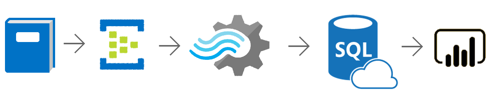
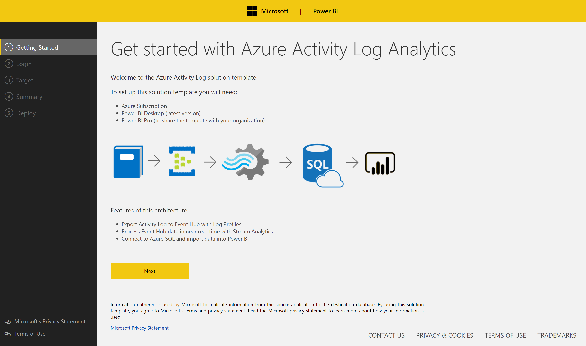
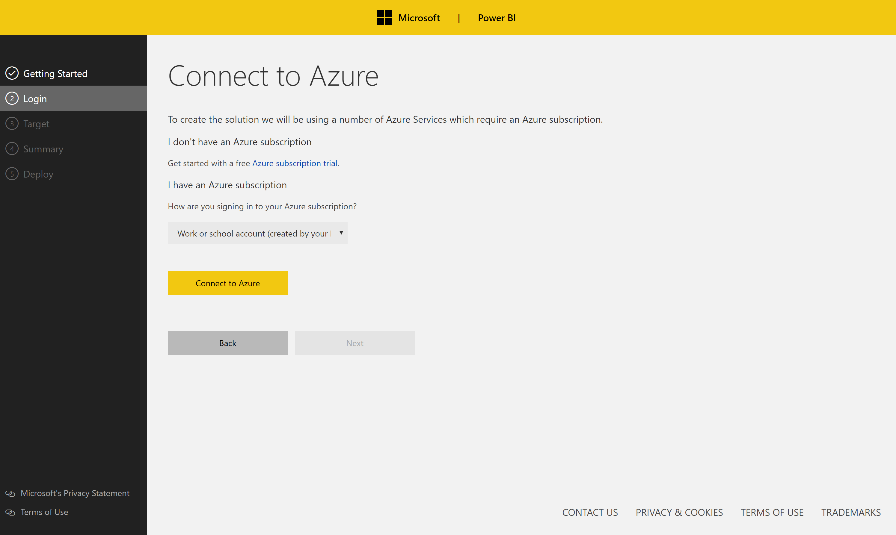
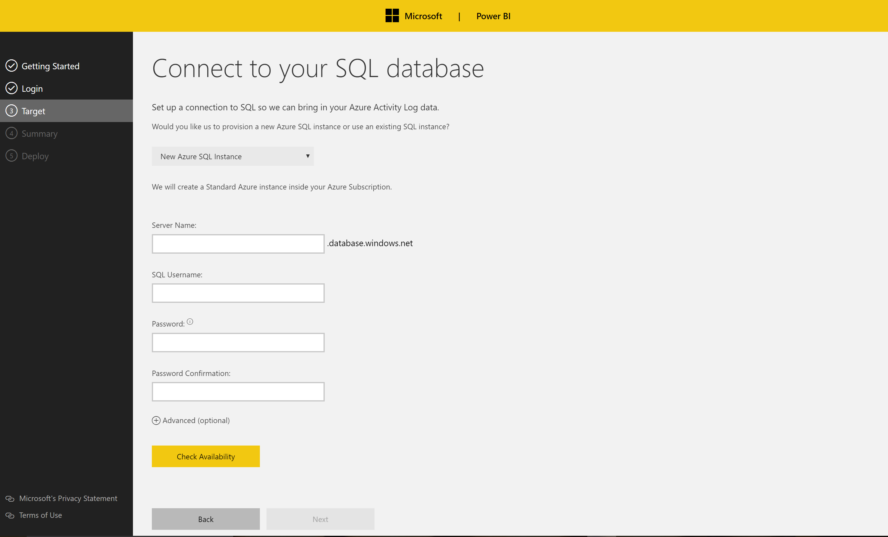
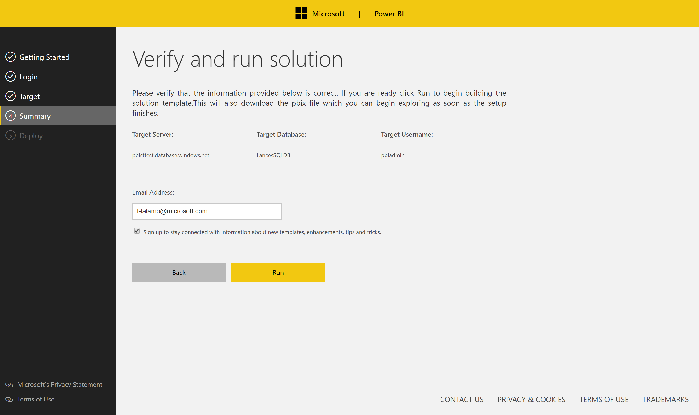
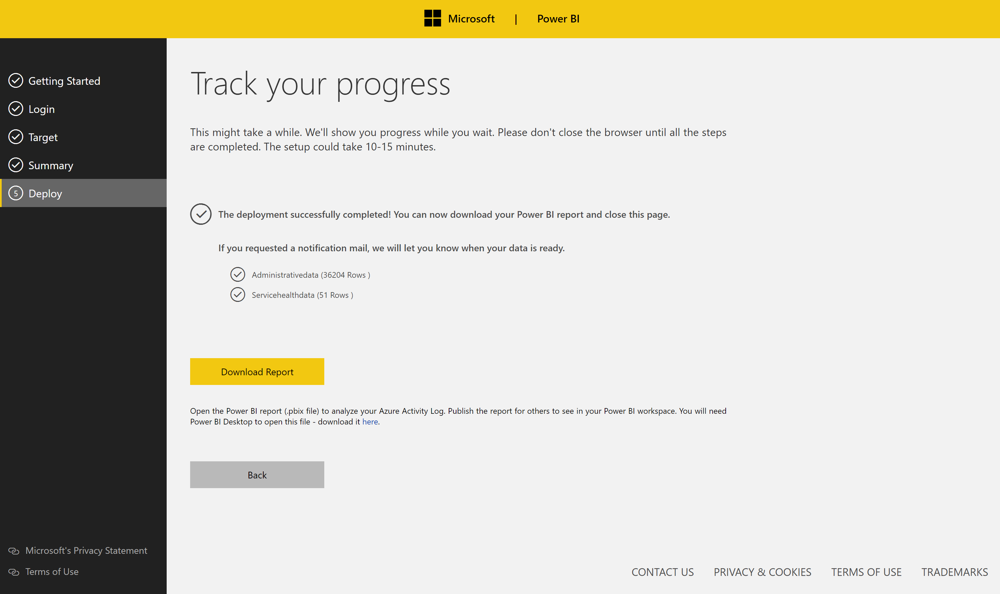
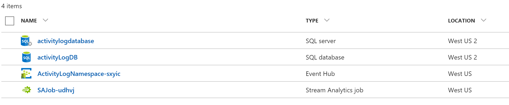

Azure Activity Log Solution Template Documentation
===========================================================

# Table of Contents
1. [Introduction](#introduction)
2. [Architecture](#architecture)
3. [System Requirements](#system-requirements)
4. [How to Install](#how-to-install)
5. [Architecture Deep Dive](#architecture-deep-dive)
6. [Model Schema](#model-schema)
7. [Reports Walkthrough](#report-walkthrough)
8. [Customizations](#customizations)
9. [Estimated Costs](#estimated-costs)

### Introduction
The Azure Activity Log Solution Template offers analytics on top of historical and live Activity Log events. An Activity Log is a collection of subscription-level events that have occured in Azure, providing full visibility into any write operations performed on the resources in your subscription. The solution template is built on a streaming platform involving Event Hub and Stream Analytics. Streaming events are collected in an Azure SQL database on top of the past 90 days of Acitivty Log data we pull in to get you started with historical trend analysis. Refresh your Power BI report to see Activity Log events appear in near real-time, or set up a streaming data set in Power BI (see Customization section). 

With the Activity Log solution template, perform subscription-level analytics such as:

-   Observe week over week changes in the aggregate number of failures or percentage of failures.

-   Compare successful versus failed opereations for particular resource groups or callers in your subscription.

-   Stay up to date with relevant Service Health announcements by regions, type, or a specific impacted resource. 

The following document provides a walkthrough of the architecture, a deep dive into every component, comments on customizability as well as information on additional topics like estimated costs. For any questions not covered in this document, please contact the team at <PBISolnTemplates@microsoft.com>

### Architecture

The flow of the Azure Activity Log solution template consists of the following resources:

-   Activity Log events are streamed to Event Hub via Log Profiles

-   Event Hub forwards the events to Stream Analytics

-   Stream Analytics processes the data and populates a SQL database

-   Power BI imports data from Azure SQL and renders pre-defined reports

### System Requirements

Setting up the template requires the following:

-   Access to an Azure subscription

-   Power BI Desktop (latest version)

-   Power BI Pro (to share the template with others)

### How to Install

Before diving into the components of the solution, we will go through how to set things up. To get started with the solution, navigate to the Activity Log template page and click **Install Now**.

**Getting Started:** Starting page introducing the template and explaining the architecture.

**Login:** Use OAuth to sign into your Azure account. You will notice you have a choice between signing into an organizational account and a Microsoft (work/school account).

If you select a Microsoft account, you will need to provide the application with a domain directory. You can find your domain by logging into the Azure portal and choosing from those listed when you click your e-mail in the top right hand corner.

Logging into Azure gives the application access to your Azure subscription and permits spinning up Azure services on your behalf. If you want a more granular breakdown of the costs, please scroll down to the Estimated Costs section.

As a user navigates away from this page a new resource group gets spun up on their Azure subscription (the name is random but always prefixed by ‘SolutionTemplate-‘). This name can be changed under the advanced settings tab. All newly created resources go into this container.

**Target:** Connect to an existing SQL Server or provide details which the application will use to spin up an Azure SQL on your behalf. Only Azure SQL is supported for this template. If a user chooses to spin up a new Azure SQL, this will get deployed in their Azure subscription inside the newly created resource group.

**Summary:** Summary page outlining all the choices the user made.

**Deploy:** When you navigate to the deployment page the setup process gets kicked off. SQL scripts run to create the necessary tables and views. Event Hub and Stream Analytics are deployed and connected to begin streaming your Activity Log data. Historical data is pulled in from the last 90 days of your activity log. 

**It is important that you do not navigate away from this page while deployment takes place.** Once everything gets deployed a download link will appear for a Power BI file which consists of the pre-defined reports.

### Architecture Deep Dive

The following section will break down how the template works by going through all the components of the solution.

Azure Resources:
----------------

You can access all of the resources that have been spun up by logging into the Azure portal. Everything should be under one resource group (unless a user was using an existing SQL server. In this case the SQL Server will appear in whatever resource group it already existed in).

### Model Schema

The Azure Activity Logs team has published documentation on the Activity Log event schema [here](https://docs.microsoft.com/en-us/azure/monitoring-and-diagnostics/monitoring-activity-log-schema#administrative).

### Reports Walkthrough

### Customizations

### Estimated Costs

Here is an estimate of the Azure costs (Event Hub, Stream Analytics, Azure SQL) involved:

The following defaults are set for you in the template (you can modify any of these after things get set up):

-   Stream Analytics : 1 Throughput Unit

-   Event Hub: 1 Throughput Unit

-   Azure SQL: Standard S1

Whilst the default setting should cater to most activity log template requirements, we encourage you to familiarize yourself with the various pricing options and tweak things to suit your needs.
