# Power BI Sales Management Solution Template for Dynamics 365 Documentation
# Table of Contents
1. [Introduction](#introduction)
2. [Architecture](#architecture)
3. [System Requirements](#system-requirements)
4. [How to Install](#how-to-install)
5. [Technical Description](#technical-description)
6. [Report Walkthrough](#report-walkthrough)

# Introduction
Create a scalable, secure and flexible PowerBI dashboard on Dynamics 365 with the Power BI Sales Management solution template for Dynamics 365. The template creates everything required for an end-to-end analytics solution on your Dynamics 365 org including the data extraction, database constructs, and a Power BI report bound to the database. You can extend or customize the result to accommodate your own business requirements.
The Sales Management solution template for Dynamics 365 is intended for customers who:
-	Want to provision an analytics solution for tens or even thousands of users
-	Want to deploy an analytics solution that scales with any size of Dynamics 365 instance from small to very large
-	Want to be able to create data mashups on Dynamics 365 with data from their ERP, marketing, inventory management or other any other application
The Sales Management solution template for Dynamics 365 is targeted at sales executives, managers and salespeople to forecast revenue, compare sales to the same period in the prior month, quarter or year, track sales against goals and monitor their pipeline .
This document describes how to provision the Sales Management solution template for Dynamics 365, the architecture, and how to extend or customize the template. The audience for this document is intended to be the IT professional or administrator who implements and manages the solution template and/or the developer who extends or customizes the solution template.
Please contact <PBISolnTemplates@microsoft.com> for any questions or issues with this document.

# Architecture
There are two architectures supporting the solution template:
-   Azure
-	On-premise

For Azure installations, all that is required is an Azure subscription (athough an existing Azure SQL DB can be used if available.)
This has all the advantages of Software as a Service where you pay as you go. All the patching and upkeep is handled for you. You can also later publish your reports to PowerBi.com.

The on-premise option encompasses on-premises SQL Server and SQL Server running on an Azure virtual machine. You are responsible for providing the hardware and SQL Server to host the extracted Sales for Dynamics 365 data. 
as well as all patching and upkeep. Publishing reports to PowerBI.com will require a separate installation of a gateway.

In both architectures, new and changed records are pulled from Dynamics 365 to populate a destination database (how data is pulled and SQL database are described in later sections) after which the approach differs.

For Azure installations, there are two options for how Power BI accesses the Sales for Dynamics 365 data:
-	Import data into Power BI
-	Live connection from Azure Analysis Services (not available for on-premise deployments)

The Import data into Power BI option (henceforth termed the import option) is where the data is pulled out of the SQL database to populate the model in Power BI. On every refresh, all the data is pulled out of the SQL database to refresh the Power BI model. When the model is published to Power BI, the data will be resident in the Power BI service:

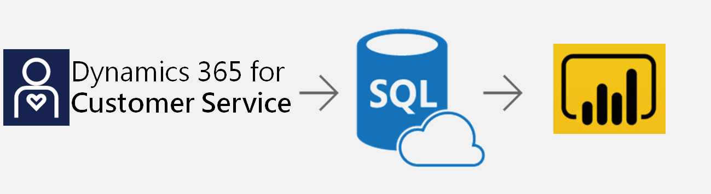

The Live Connection from Azure Analysis Services (henceforth termed the AAS option) is where the data is pulled from the SQL database to populate an Analysis Services tabular model. The Power BI reports are bound to the Analysis Services tabular model instead of directly to the SQL Database. 

When the model is published to Power BI, the data stays in Analysis Services and does not move with it to the Power BI service. Viewing published reports results in queries sent to Analysis Services from the Power BI service:
The Import option is recommended when:
-	The amount of data in Power BI is less than the 1 GB limit (remember, this is a compressed size representing a data volume roughly 10x this size, or 10GB of Dynamics 365 data.

The AS option is recommended when:
-	The amount of data in Power BI is greater than 1 GB or might be greater than 1 GB in the future.
-   You need the extra performance available with Azure Analysis Services service tiers
-	You want the data available for reporting with other tools in addition to Power BI that can take advantage of Analysis Service’s capabilities.

# System Requirements
Setting up the template requires the following:
-	an Azure Subscription or SQL Server Database 2008 R2 or later,
-	Power BI Desktop (latest version)
-	Power BI Pro (to share the template with others)
-	Dynamics 365 for Sales 2015 or later, on-premises or Online.

**You must have administrative permissions on your Dynamics 365 for Sales instance**. You can check whether you are a system administrator
 [here](https://www.microsoft.com/en-us/dynamics/crm-customer-center/find-your-dynamics-365-administrator-or-support-person.aspx). 

# How to Install
Installing the Sales Management solution template for Dynamics 365 configures the following:
-	Data extraction
-	SQL Server database or Azure SQL Database
-	SQL Server Analysis Services (optional)
-	Power BI Desktop file (SalesManagement.pbix)
The detailed description of each component of the architecture is below. To get started, navigate to the Power BI solution templates from the Solutions menu on powerbi.com: 

From there, select the Sales Management for Dynamics 365 solution template and click the “Install now” button.

## Step 1: Azure SQL DB  or SQL Server
The first step is to choose the source of the data - Dynamics 365 Online or on premise:

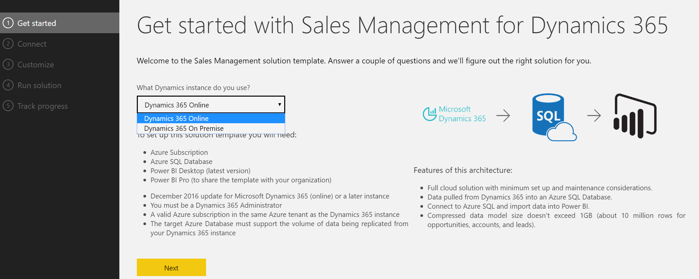

If Dynamics 365 Online is chosen, jump to Step 2a:Connect to Dynamics 365 Online. Otherwise jump to Step 2b: SQL Server Installation.

## Step 2a: Choose how to Move Data
Select how to move your data. 

Data Export is an add-on service made available as a Microsoft Dynamics
365 online  that adds the ability to replicate Dynamics 365 online data to
a Microsoft Azure SQL Database store. Data is copied in real-time.

Scribe is a third party data integration platform. Choose this option if you have an existing account or plan on creating an accoutn with Scribe.

## Step 3a: Connect to Dynamics 365 Online

Next, connect to your Dynamics 365 instance to give permission to the provisioning application to set up data export service to populate the Azure SQL DB destiniation.

**Note: You must have an Azure subscription in the same tenant as Dynamics 365.** 

An Azure subscription grants you access to Windows Azure services and is the means by which resource usage is reported and services are billed.
A tenant is a representation of an organization in Azure. It is also called a dedicated instance of Azure Active Directory. You may have an Azure subscription already, but it must be in the same tenant as your Sales for Dynamics 365 instance to be used for the solution template. To see if you have an Azure subscription in the same tenant:

-	connect to the Azure portal (https://portal.azure.com) using the same credentials you connect to Sales for Dynamics 365.
-	On the left panel, click the “Subscriptions” item.
If you see a subscription on the right panel, you satisfy this requirement. If no subscription exists, it is simple, fast and free to create one.
by following the instructions here: <https://account.windowsazure.com/subscriptions/>. 

## Step 4a: Specify Azure Subscription

Choose the Dynamics 365 organization and specify the Azure subscription used to contains newly created resources.

Click "Next".

## Step 5a: Set up Azure Key Vault
Note: This is required for Data Export Services. Scribe does not require Azure Key Vault.

Azure Key Vault is a secure mechanism to store credentials to Azure SQL DB. The next step creates an Azure Key valut instance.

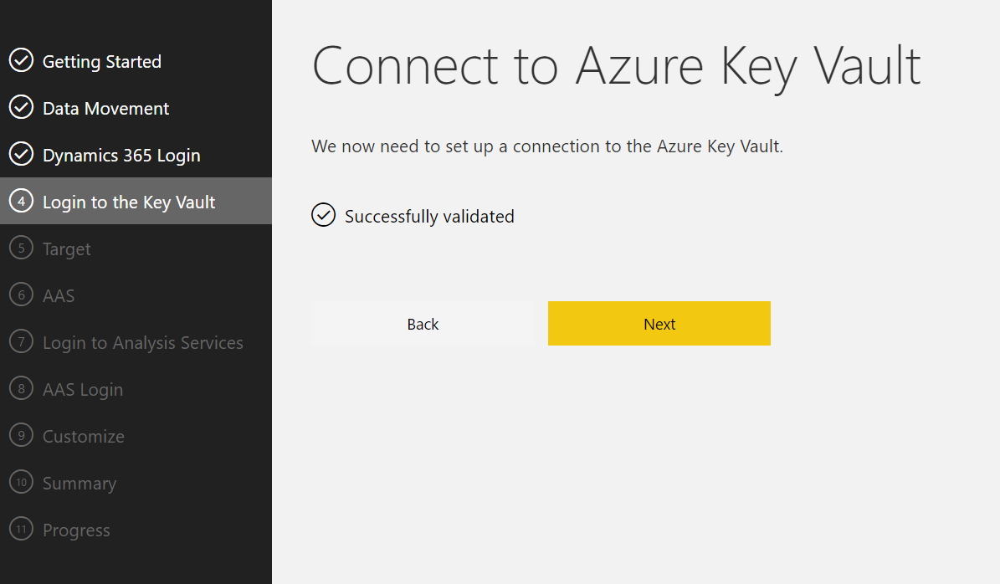

Click “Next” to continue.

## Step 6a: Connect to new or existing Azure SQL DB
Connect to an existing SQL Server or provide details which the application will use to spin up an Azure SQL on your behalf. Only Azure SQL is supported for this template. If a user chooses to spin up a new Azure SQL, this will get deployed in their Azure subscription inside the newly created resource group.

Open the advanced tab to change the service tier of the destination Azure SQL Database or datacenter location.

**_Important note_**: If you use an existing Azure SQL DB, you **_must_** safelist your client IP address shown on this page in the Azure portal before you continue.
If you do not, you will not be able to read data from Azure SQL DB to populate the Power BI file. To safe-list the IP addresses, follow the instructions [here](https://azure.microsoft.com/en-us/documentation/articles/sql-database-configure-firewall-settings/).

Click “Next” to continue.

## Step 7a: Tailor your Sales Management solution template for Dynamics 365
Provide the starting month of your fiscal calendar. This is required for fiscal year calculations in the Power BI file. 

## Step 8a: Azure Analysis Services Election
Choose whether Azure Analysis Services is to be used in the solution.c

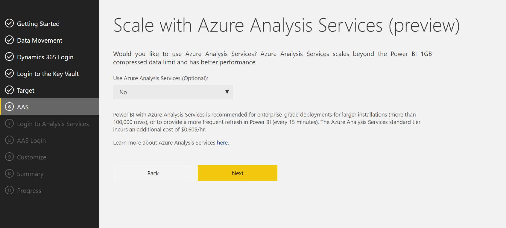

## Step 9a: Configure Azure Analysis Services
If Azure Analysis Services was chosen, create a new instance of Analysis Services or use an existing one.

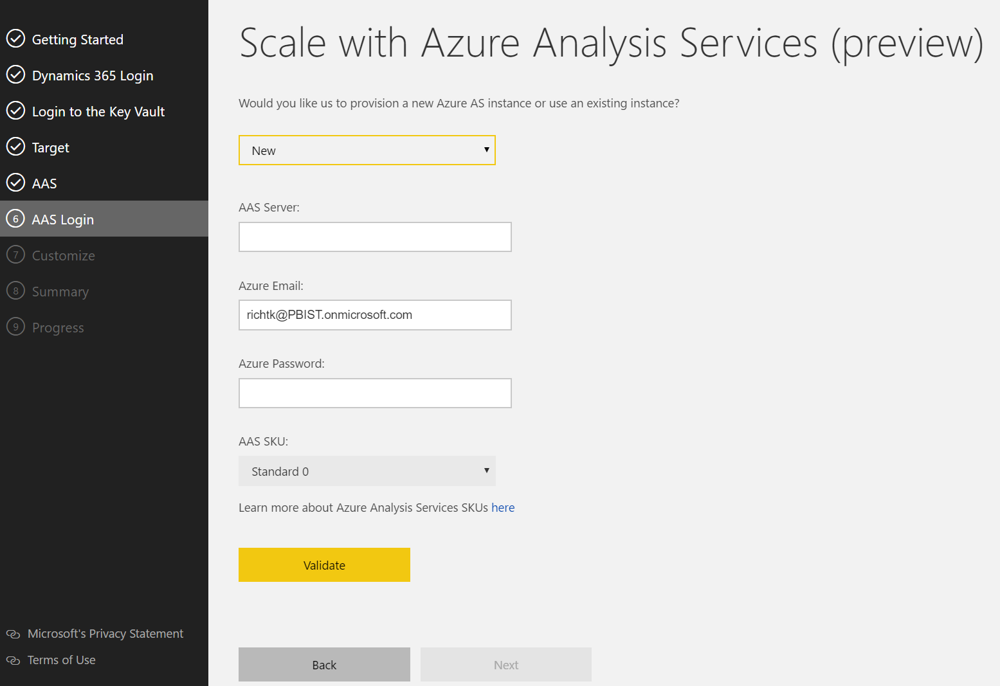

For new instances, select the Azure Analysis Services service tier. Learn more about Azure Analysis Services service
 tiers [here](https://azure.microsoft.com/en-us/pricing/details/analysis-services/)

 The credentials provided are used as the system administrator for the Azure Analysis Services instance. When connecting to this instance, these credentials must be used (unless other users have been provided access separately).

## Step 10a: Tailor your Sales Management solution template for Dynamics 365
Provide the starting month of you8 fiscal calendar. This is required for fiscal year calculations in the Power BI file. 

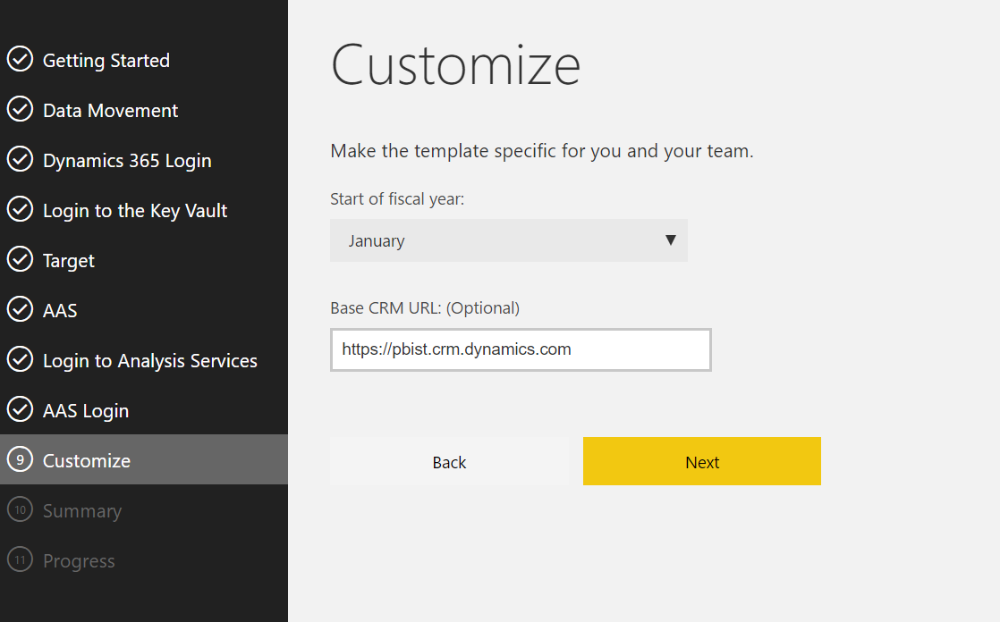

The base Dynamics 365 URL is provided for links for each opportunity, lead and account in the power BI reports.

Click “Next” to continue.

## Step 11a: Verify and Run Solution
Verify the values entered.

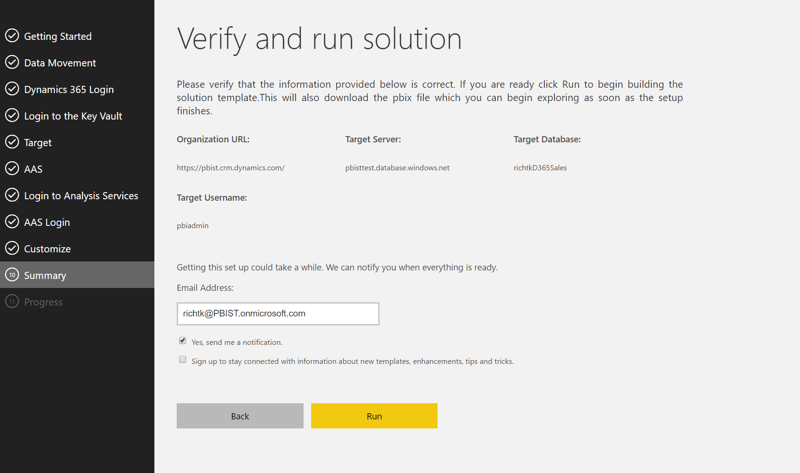

Provide your email to be notified when the data has finished moving and the reports are ready for viewing.

Click “Next” to continue.

## Step 12a: Track Progress
The next several steps actually provision the soluution template. 
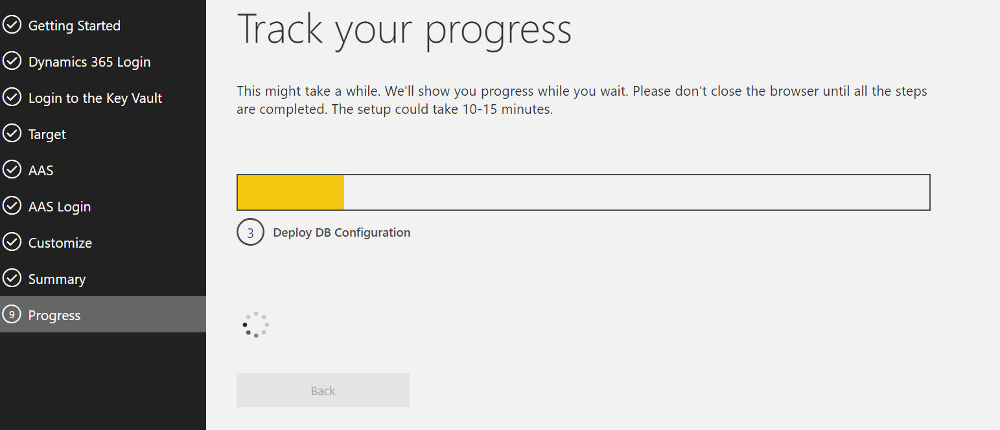

Once data starts moving, A Power BI file can be downloaded that is bound to the database specified earlier. 
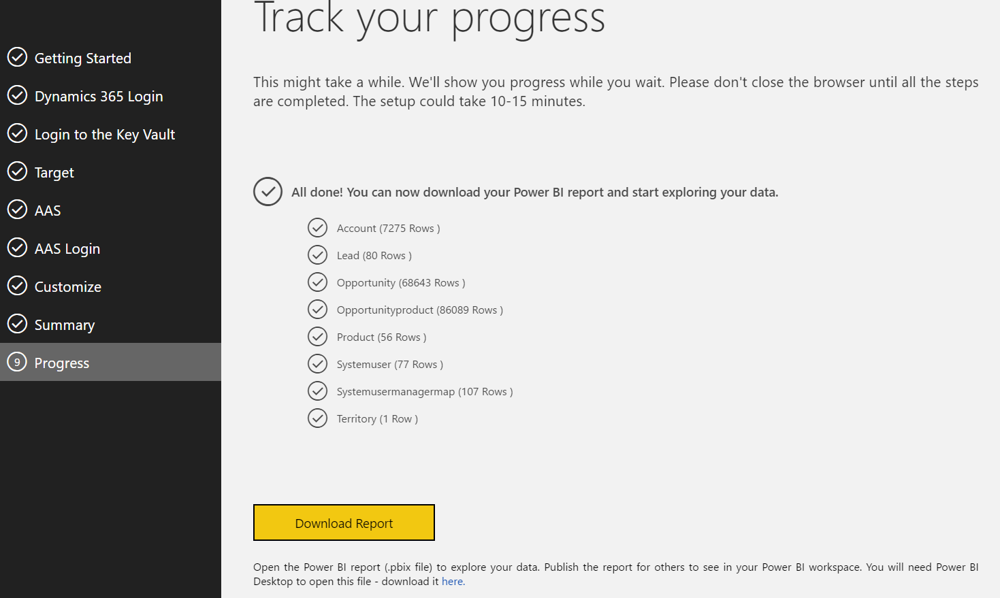

The Power BI report file (or pbix file) is pre-bound to the data destination (either Azure SQL Server or Azure Analysis Services). Follow the instructions on the first page in the report to show your data.

## Step 2b: SQL Server Options
If Dynamics 365 on premise was selected, choose between SQL Server (on-premise of Azure VM) or Azure SQL DB.
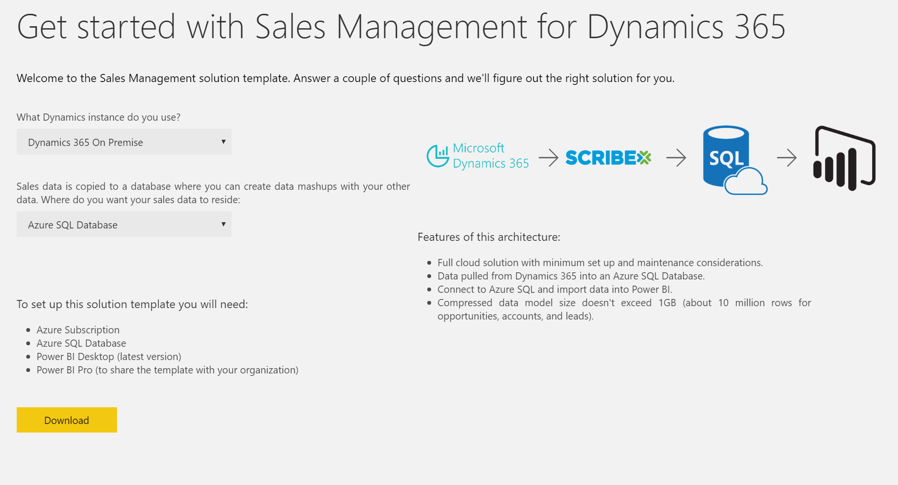

Click the “Download” button at the bottom of the page to download the installer for the solution template and install the solution template.

## Step 3b: Connect to ETL provider for Dynamics 365 On-prem

The solution template for SQL Server requires an ETL agent to be installed to move data from Dynamics 365 to the on-premises SQL Server or to SQL Server on an Azure VM. The agent can be installed on any machine with access to the destination but it is recommended to install the agent on the same machine.

New Scribe users must first create an account and install the Scribe Online Agent. Instructions for downloading and installing the Scribe Online Agent can be found [here](http://help.scribesoft.com/scribeonline/en/sol/agent/agentinstall.htm). Once the account is created, install the Scribe Online Agent.
o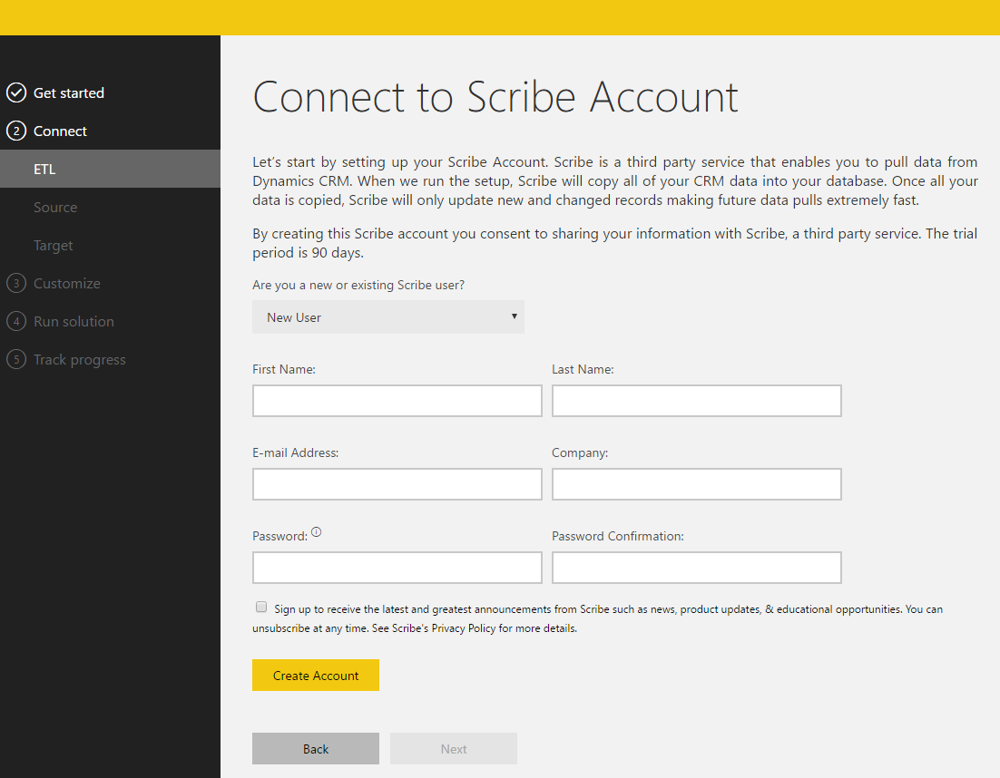

_Note: the list of Scribe Online agents are those registered with this account – not those installed on the machine._

Once the ETL account is created and agent is installed, change the selection “New User” selection to “Existing User”, provide your credentials and click the Validate button.

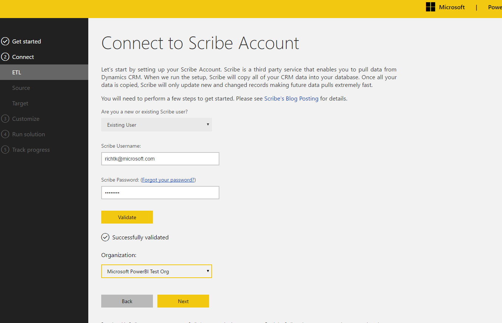

The Organization drop down will contain at least one item created by the solution template (for existing Scribe users, this will contain all Scribe organization with replication enabled).

The Installed agent should appear in the agent dropdown. If it does not, verify your installation of the Scribe online agent. 

Click “Next” to continue.

## Step 4b: Connect to Dynamics 365
Provide your Dynamics 365 credentials to gain access to Dynamics 365.  The Dynamics 365 login URL normally does not need to be changed from the default <https://pbist.crm.dynamics.com>

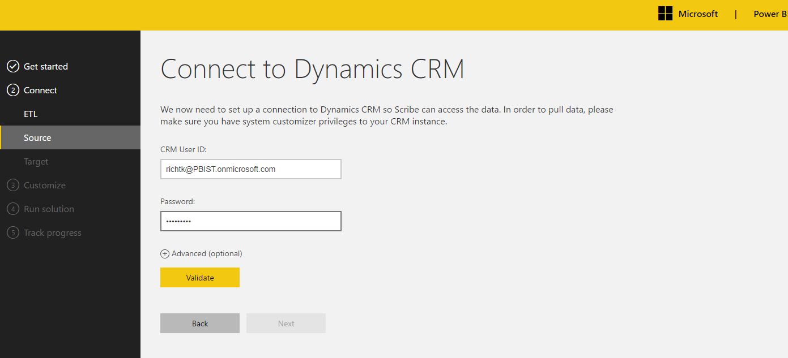

 Validate your credentials and click ‘Next’.

The Advanced option allows one to select the Discovery Web service URL and manually enter the Organization (note that the Organization is **case-sensitive**).

If on-premise Dynamics 365 was selected earlier, the URL can be edited directly. Refer [here](https://msdn.microsoft.com/en-us/library/gg328127.aspx) to learn more about URL discovery for Dynamics 365.

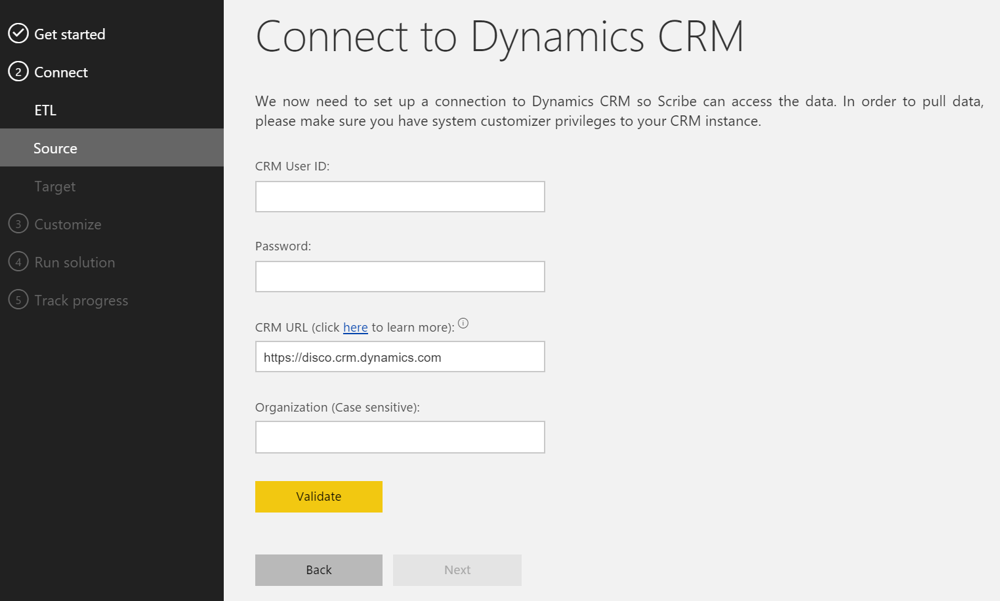

### Step 5b: Connect to SQL Server Database

Provide your Azure SQL Database credentials to gain access to the destination SQL Server database. Click validate check your credentials.

If SQL Server Analysis Services (SSAS) is used, enter an existing SSAS server name and the name of a new Analysis Services database. This SSAS database will be created on your behalf.

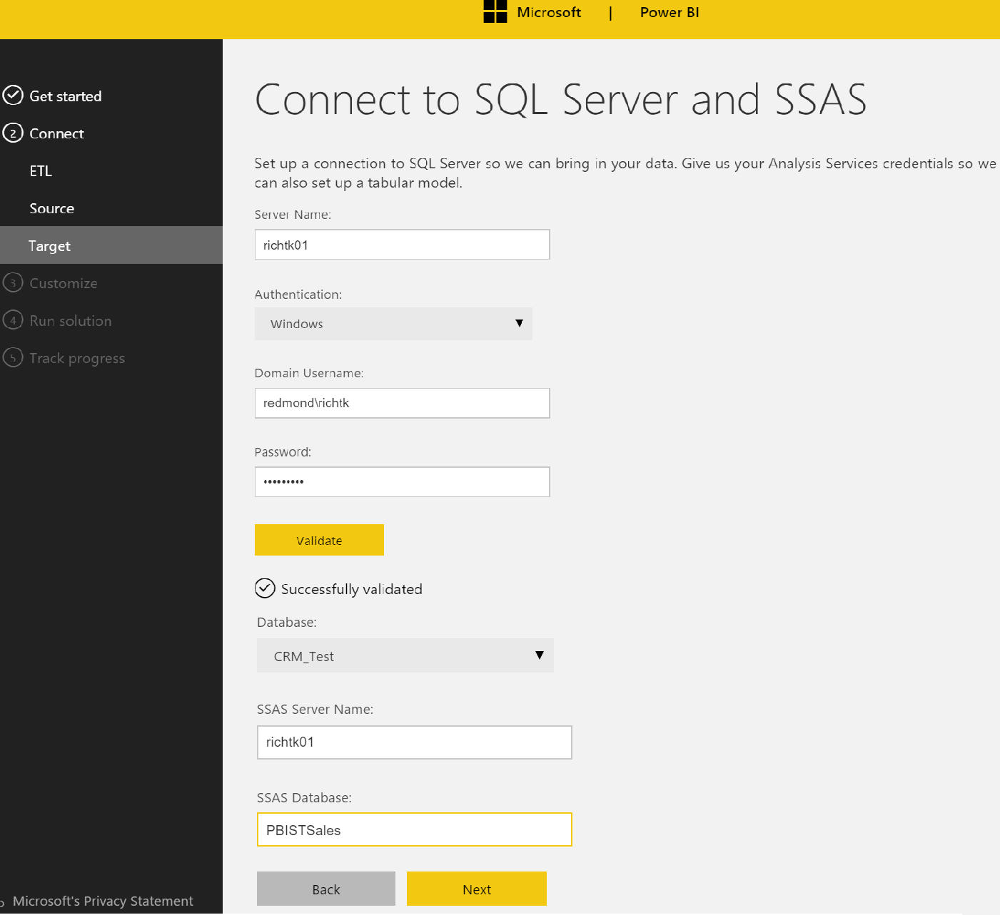

## Step 6b: Tailor your Sales Management solution template for Dynamics 365
Provide the starting month of your fiscal calendar. This is required for fiscal year calculations in the Power BI file. 

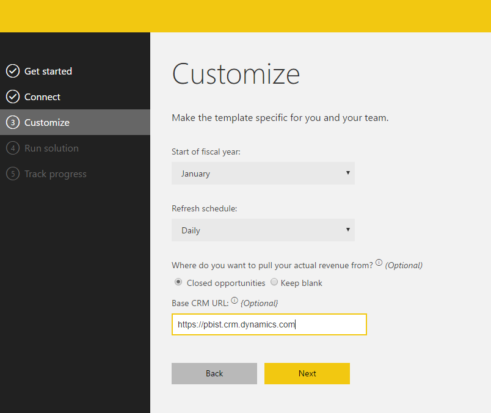

Define how often the data is refreshed from Dynamics 365. Note that the initial extraction can take some time – even up to a day. Once that is complete, subsequent extractions pull new and changed records only and complete very quickly.

If you provide the base Dynamics 365 URL, hyperlinks are created for each opportunity, lead and account to enable linking from Power BI reports directly into the related Dynamics 365 object; e.g.
<https://pbist.crm.dynamics.com>.

Click “Next” to continue.

## Step 7b: Validate and Track Progress
Scrutinize the information provided for errors. If everything is correct, click “Download & Run” to create the solution template.

Click “Next” to continue. The next page tracks your progress. Once the data starts to move, this page can be closed and the data will continue to be copied.
Click the “Download PBIX” button to download a Power BI file, SalesManagementReport.pbix, that is bound to the chosen SQL Azure database.

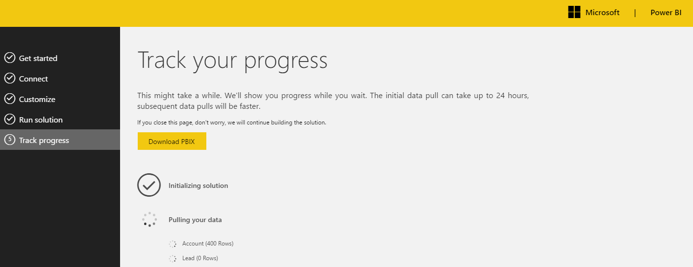

## Step 8: Open the Power BI file

If the data was imported directly into Power BI, then:
Open the downloaded Power BI file and take the following steps:
a)	Click “Apply Changes”

b)	Windows Credentials
On the windows tab, select “Use my current credentials”:

c)	Database Credentials
Click the Database item in the left-hand pane and enter the username and password you provided for the Azure SQL database:
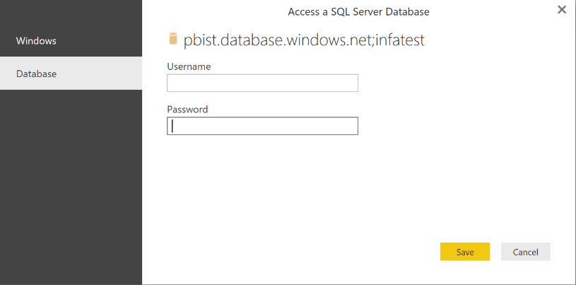
Click “Save”.

Otherwise if Analysis Services was used:
Open the Power BI file. ON the Home menu tab, select Edit Queries, then Data Source Settings:
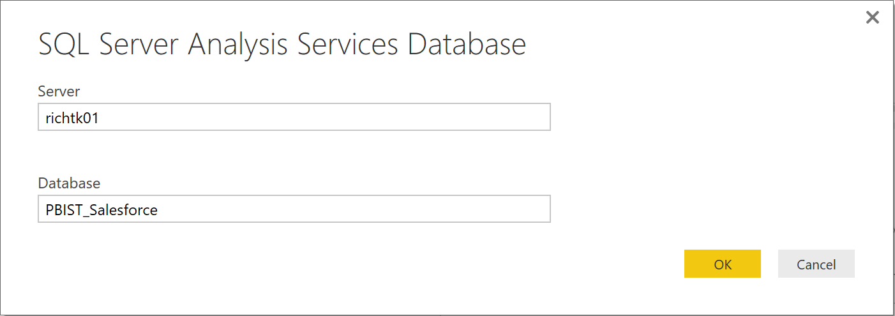
Enter the Server and Database name entered in the previous step and click OK. The Navigator dialog will appear:
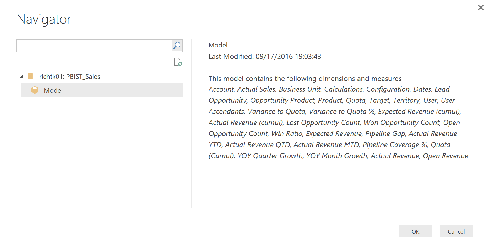
Click OK to view the report.
## Step 9: View the Report
At this point Power BI Desktop will connect and retrieve the data. Note that it may take some time for the initial data pull to finish.  

## Common Provisioning Questions
**I closed the “Track your Progress” page. How do I know when the data has been pulled out of Dynamics 365?**
You can connect to the ETL provider to track progress. For Scribe, connect to <https://online.scribesoft.com/ScribeOnline.aspx#/Logon> and use the credentials used to create the account.

**I didn’t download the Power BI file (the pbix file) but closed the “Track your Progress” page where it is downloaded from. Now what?**
You can repeat the provisioning process or find the pbix file [here](https://github.com/Microsoft/BusinessPlatformApps/blob/dev/Source/Apps/Microsoft/Released/Microsoft-CRMSalesManagement/Service/PowerBI/SalesManagementReport.pbix).

**I want to change how often data is extracted from Dynamics 365. How do I do that?**
Connect to your ETL provider:
- Scribe: <https://online.scribesoft.com/ScribeOnline.aspx#/Logon>.

Edit the replication task and change the schedule. Instructions for your ETL provider are beyond the scope of this document, but this is a simple matter of altering a schedule.

# Report Walkthrough

The aim of this section is to walk through the Sales Management Solution Template.
 
Sales Managers manage anywhere between a few individual salespeople to many sales teams with multiple levels of hierarchy. Sales teams use Dynamics 365 to input information about the open opportunities they are working on and use an ERP system to track actual sales (i.e. all of the opportunities the sales team(s) have closed). Performance is measured against quotas set against salespeople and/or products. 

Sales Managers are interested in tracking overall performance and progress but also want to see how sales teams or even individual sales people are performing. When measuring progress, it is important to see all data  such as open revenue, closed revenue and quotas together in one place. This allows them to answer key questions like:
-	Which opportunities did I lose yesterday? Which of those was I expecting to win?
-	How much actual sales have I closed this month? How does this compare to the same time period last year or the year before?
-	How much pipeline coverage do I have for this quarter? How does this differ by sales team and product?
-	What does my win loss ratio look like for salespeople and my products?

The next few pages go through a detailed walkthrough of each page of the Sales Management reports. They include a high-level aim of the page, a description as well as screenshots.

## Sales Performance

The purpose of the Sales Manager page is to use historical data to evaluate the current performance of one or more sales teams.

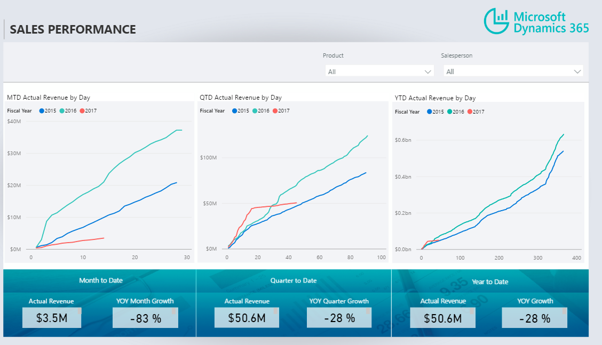

## Sales Summary
The purpose of the Daily report is for Sales Managers to view detailed information about important things that change on a daily basis.

The ‘Daily View’ page is split into two key sections: ‘Looking Back’ and ‘Looking Ahead’.

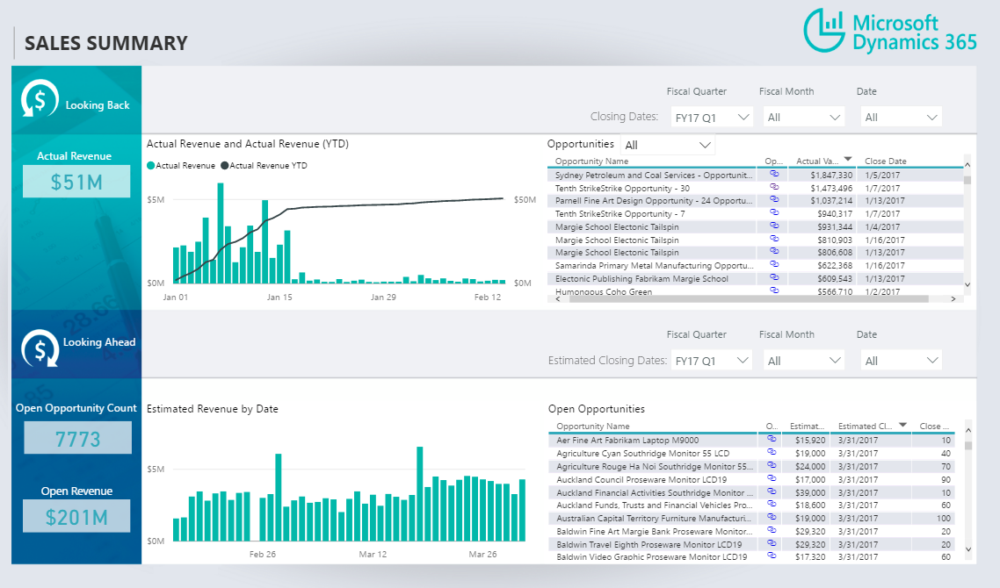

The ‘Looking Back’ View is concerned about reporting on things that have already happened this quarter. There are two key tables to focus on – the revenue a team has brought in this quarter and the opportunities that have been lost this quarter. On the left hand side one can see the ‘Variance to Prior Day’ metric. This provides a quick indicator of how sales have changed since yesterday. 

‘Looking Ahead’ on the other hand, is concerned with the opportunities that remain open this quarter. It provides details on who owns a given opportunity, how much it’s worth and when should it close. A key metric given on the left hand side is how much revenue is in the pipeline. 

An important aim of the ‘Daily View’ however, is to give a Sales Manager the finest level of granularity they may wish to view their data by. Whilst the default report page looks at things on a quarter level, a Sales Manager may be interested in seeing the opportunities that were lost this week or the opportunities that are expecting to close tomorrow. By using the time slicers present on the page, a Sales Manager can view their data at a month, week or day level. The slicers at the top of the page update the ‘Retrospective view (i.e. the past), whereas the slicers in the second half of the page update everything ‘Looking Ahead’. 

## Sales Detail
The purpose of the Sales Detail page is to use historical data to evaluate the current performance of one or more sales teams.

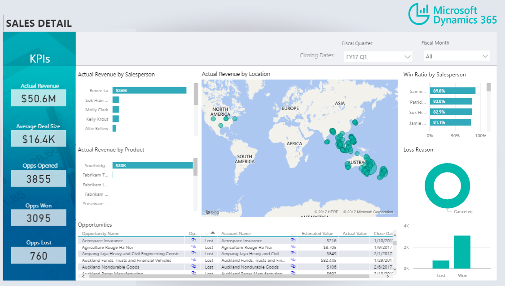

The left hand charts illustrate the revenue by salesperson and products. The charts in the right hand panel show key sales indicators.

## Pipeline View
The purpose of the Pipeline view is to monitor the health of the sales pipeline

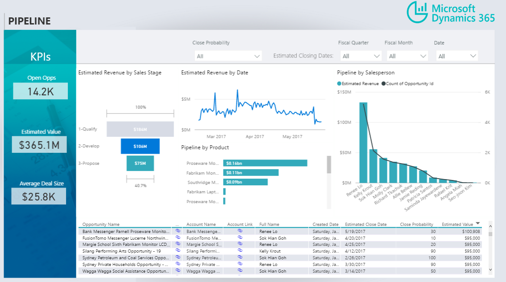

This view focuses on the health of the sales pipeline. The main way pipeline health is evaluated is by measuring pipeline coverage (i.e. by summing up actual sales with all my open opportunities, does that compare to quota). Some sales mangers like to use percentages higher than 100% (e.g. 120%) to indicate a healthy pipeline as they assume not all opportunities will be closed. In our report, any pipeline coverage above 100% appears as green. On the report pipeline coverage is also split by sales team/salesperson and product to provide a more detailed understanding of pipeline.

## Lead View
The purpose of the Lead view is to monitor the health of the leads pipeline - by source, date, who they are assigned to and how many and key indicators.

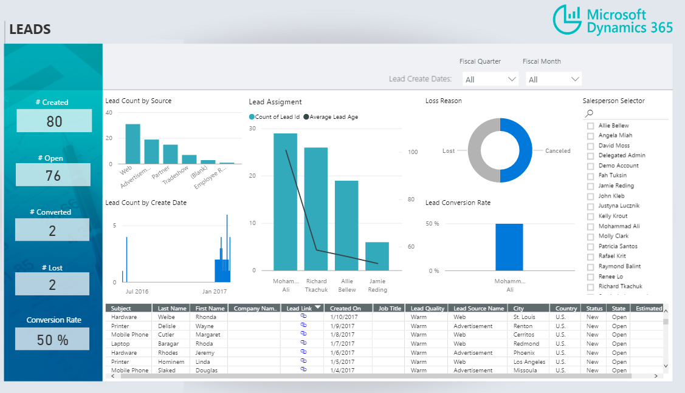

# Technical Description
This section describes each component of the solution template in detail.
## Data Extraction and Load
The sales management solution template utilizes Scribe replication jobs. The following tables are replicated:
-	Account
-	BusinessUnit
-	Lead
-	Opportunity
-	OpportunityLineItem
-	OpportunityStage
-	Product2
-	UserRole

The tables are replicated with custom fields already included.
Additional entities can be replicated to the target database. Refer to Scribe for instructions to add additional entities to the replication or modify the replication schedule.

## SQL Server DB - SQL Server or Azure SQL Database 
### Tables
Tables replicated from Dynamics 365 are replicated to the dbo schema. Other tables and any other objects are created in the schema smgt.

The following additional tables are added to the target database.

| Table         |	Description |
| -----         | ------------  |
| ActualSales	| An empty table for the installer to copy actual sales data. This table is used to source actual sales if the solution template is configured to do so.       |
|Configuration	| Contains the values to configure the solution template. |
|Date			|A calendar table created for time analysis with a day granularity.|
|Quotas			|An empty table for the installer to copy quota data. |
|UserMapping |	Maps Dynamics 365 users to domain users. The installer is responsible for populating this table.|

### Configuration Table

| Column         | Datatype     | Description |
| ---------------|--------------|--------------|
| id	                 | int		        | Identifier for configuration value |
| configuration_group	 | 	varchar(150)	|  	Mechanism for grouping config values |
| configuration_subgroup | 	varchar(150)	| Mechanism for grouping config values |
| Name		             | varchar(150)	    | 	The name of the configuration value |
| Value		             | varchar(max)	    | 	|
| Visible	             | bit	            | Whether or not the configuration value is visible in the Power BI reports. |

The values in the configuration table are defined below:

| configuration_group	| configuration_subgroup | name               | Description |
| ----------------------|------------------------|--------------------|-------------|
| SolutionTemplate      |   SalesManagement	     | version	          |             |
| SolutionTemplate      |	SalesManagement	     | BaseURL	          | The URL for Dynamics 365 content. If populated, drill through to Dynamics 365 objects is enabled; eg, <https://pbist.crm.dynamics.com> |
| SolutionTemplate      |   SalesManagement	     | FiscalMonthStart   | Numeric value of fiscal month designating the beginning of the fiscal year. Expected values 1 through 12 |
| SolutionTemplate	    |    SalesManagement	 | Source	          | Indicates source application. Do not change. |

### Date

The Date table is autogenerated with the installation of the solution template from 2013 to 2020.

| Column         | Datatype     | Description |
| ---------------|--------------|--------------|
| date_key      | 	int	      | Numeric datekey in the format yyyymmdd |
| full_date      | 	date	      |  |
| day_of_week      | 	tinyint	      | Day of week – 1 though 7 |
| day_num_in_month      | 	tinyint      | 	Day of month – 1 through 31 |
| day_name      | 	char(9)      | The day name. can be edited to localize |
| day_abbrev      | 	char(3)      | 	Day abbreviation; eg, Mon for Monday |
| weekday_flag      | 	char(1)      | 	y for weekday, n for weekend |
| week_num_in_year      | 	tinyint      | 	Week numer in year ranging from 1 to 52 |
| week_begin_date      | 	date      | 	The date of the beginning of the week for the current date |
| week_begin_date_key      | 	int      | 	The date key of the beginning of the week for the current date |
| month      | 	tinyint      | Month number raning from 1 through 12. |
| month_name      | 	char(9)      | 	Long month name; eg, January |
| month_abbrev      | 	char(3)	      | Short month name; eg, Jan |
| quarter      | 	tinyint	      | Calendar quarter number, from 1 through 4 |
| year	      | smallint       | Year number; eg, 2017 |
| yearmo      | 	int      | Year  and month number; eg, 201703 for March, 2017 |
| last_day_in_month_flag      | 	char(1)      | Set to n if not the last day in the calendar month, set to y for last day in calendar month. |
| same_day_year_ago_date      | 	date      |  |
| same_day_year_ago_key      | 	int	      |  |
| day_num_in_year      | expression      | 	Number of the current day in the calendar year. |
| quarter_name      | 	expression      | 	Name of the current calendar quarter; eg, Q1 |

### UserMapping
The UserMapping table is populated during data transfer.  The contents of this table are used if row level security is implemented. Otherwise it can be ignored.

| Column         | Datatype     | Description |
| ---------------|--------------|--------------|
| UserID      | varchar(50)      | Dynamics 365 UserId |
| DomainUser      | varchar(50)      | The domain name for each user. This does not come from Dynamics 365 but is derived during the data load process. Refer to the SQL Agent section.  |

## Views
The Power BI file or, optionally, SSAS is bound to the views. These are defined below:

### AccountView
AccountView is bound to the Account table.

| Column         | Datatype           |  Source      | Description  |
| ---------------|--------------------|--------------|--------------|
| [Acccount Id]  | 	nvarchar(18)      | accountid    |          |
| [Account Name]      | 	nvarchar(255)      | 	Name	|    |
| [Owner Id]      | 	nvarchar(18)      | 	ownerId	 | |
| Industry      | 	nvarchar(40)      | 	IndustryCode_displayname | |
| [Business Unit  Id]      | 	int      | 	owningbusinessunit  |
| City      | 	nvarchar(40)      | 	address1_city	 | |
| State      | 	nvarchar(40)      | 	address1_stateorprovince	 | |
| Country      | 	nvarchar(80)      | 	address1_Country	| |
| [Annual Revenue]      | 	Float      | revenue	| |

### BusinessUnitView
This view is populated from the UserRole table. It is “flattened” from the recursive source. That is, instead of a recursive parent child relationship, the first three levels are separate columns.

| Column         | Datatype           |  Source      | Description  |
| ---------------|--------------------|--------------|--------------|
| [Business Unit Id]	 | 	nvarchar(18)	 | 	UserRole.ID	| |
| [Business Unit Name]	 | 	nvarchar(80)	 | 	Name	| | 
| Level	 | 	int	 | calculated | 0-based level depth where 0 represents top level.|	
| Level1	 | 	nvarchar(80)	 | | The top level of the business unit. This is always populated
| Level2	 | 	nvarchar(80)	 | | The second level of the business unit where level>1, otherwise null
| Level3	 | 	nvarchar(80)	 | | The thrird level of the business unit where level>2, otherwise null

Note that business units recursing deeper than third level are not included and are included as the third level.

### ConfigurationView
This view is exclusively populated from the smgt.Configuration.

| Column         | Datatype           |  Source      | Description  |
| ---------------|--------------------|--------------|--------------|
| Id | int | Id | Values are only included in the view if visible=1 |
| [Configuration Group] | varchar(150) | configuration_group | |
| [Configuration Subgroup] | varchar(150) | configuration_subgroup	| |
| Name | varchar(150) | name | 	|
| Value | varchar(max) | value	 |  |

### DateView
All Dateview columns are exclusively from the Date table.

| Column         | Datatype           |  Source      | Description  |
| ---------------|--------------------|--------------|--------------|
| date_key | char(150) | [full_date]	 |  | 
| [Day of the Week] | tinyint | [day_of_week] | |
| [Day Number of the Month] | tinyint | [day_num_in_month]	 | |
| [Day Name] | char(9) | [day_name] | Long day name; eg, Monday |
| [Day Abbreviated] | char(3) | [day_abbrev] | Short day name; eg, Mon |
| [Weekday Flag] | char(1) | [weekday_flag]	 | |
| month | tinyint | month | integer month from 1 to 12 |
| [Month Name] | char(9) | month_name | Long month name |
| [month_abbrev] | char(3) | [month_abbrev]	 | |
| quarter | tinyint | Quarter | |
| Year | smallint | year |  |
| same_day_year_ago_date | date | same_day_year_ago_date | |
| [Week Begin Date] | date | [week_begin_date] | |

### LeadView

| Column         | Datatype           |  Source      | Description  |
| ---------------|--------------------|--------------|--------------|
| [Status] | nvarchar(255) | statuscode_displayname | Values are only included in the view if visible=1 |
| [Lead Quality] | nvarchar(255) | leadqualitycode_displayname | |
| [Subject] | nvarchar(300) | Subject	| |
| [Job Title] | nvarchar(100) | [jobtitle | |
| [Lead Id] | nvarchar(18) | leadId	 |  |
| [Estimated Amount Base] | int | estimatedamount_base |  |
| [Owner Id] | nvarchar(18) | OwnerId |  |
| [State Code] | int | statecode_displayname |  |
| [Campaign Id] | int | campaignid | |
| [Estimated Close Date] | datetime | estimatedclosedate |  |
| [Lead Source Name] | nvarchar(255) | LeadSourcecode_displayname |  |
| [Industry Name] | nvarchar(255) | Industycode_displayname | |
| [Purchase Time Frame] | nvarchar(255) | purchasetimefrmae_diplayname	 |  |
| [Created On] | datetime | CreatedOn |  |
| [Company Name] | nvarchar(100) | companyname	 | | 

### MeasuresView
This is an empty table that is used as a source for calculated measures in Power BI.

| Column         | Datatype           |  Source      | Description  |
| ---------------|--------------------|--------------|--------------|
| MeasureValues	| int | Calcuated column	| |

### OpportunityProductview
All values in this view are taken from the opportunitylineitem table.

| Column         | Datatype           |  Source      | Description  |
| ---------------|--------------------|--------------|--------------|
| [Product Id] | nvarchar(18) | productid	 |  |
| [Opportunity Id] | nvarchar(18) | opportunityid	 |  |
| Revenue	 | float | baseamount_base	 |  |

### Opportunityview

| Column         | Datatype           |  Source      | Description  |
| ---------------|--------------------|--------------|--------------|
| Opportunity Id | nvarchar(18)| opportunityid	| |
| [Opportunity Name] | nvarchar(120) | name	| |
| [Owner Id] | nvarchar(18) | ownerid | |
| [Actual Close Date] | date | actualclosedate |  |
| [Estimated Close Date] | date | estimatedclosedate |  |
| [Close Probability] | float | closeprobability	 | |
| [Account Id]	nvarchar(18) | parentaccountid | |
| [Actual Value] | float | actualvalue |  |
| [Estimated Value] | float | estimatedvalue |  |
| Status | nvarchar(40) | statuscode_displayname	 |  |
| [Sales Stage] | nvarchar(40) | stagename | |
| [Sales Stage Code] | int | stepname  | extracted from the string |
| State | varchar(4) | statecode_displayname |
| [Lead Id] | int | originatingleadid |  |
| [Opportunity Rating name] | float | opportunityratingcode_displayname | |
| Source | nvarchar(4) | null | |

### Productview
All values are sourced from the Product table which is "unwound" from the recursive relationships therein.

| Column         | Datatype           |  Source      | Description  |
| ---------------|--------------------|--------------|--------------|
| [Product Id] | nvarchar(18) | ID	 | |
| [Product Name] | nvarchar(120) | name	 | |
| Level | int | 1 | level depth |
| [Product Level 1] | varchar(30) |  name | |
| [Product Level 2] | varchar(30) |  name | |
| [Product Level 3] | varchar(30) |  name |  |

### UserAscendantsview
This view is used for row level security. It contains a row for every combination of individual another person one or more levels above in the reporting hierarchy as defined by the role the user has been assigned to. For example, consider when person A reports to person B who reports to person C. This table will contain:

| User | Ascendant User |
|------|----------------|
| A | A |
| A | B |
| A | C |
| B | B |
| B | C |
| C | C |

_Note: the reporting hierarchy is taken from a user’s role assignments and not the user’s  ManagerID as defined in the user table. If this behavior is required, edit the UserAscendantView definition._

Security is defined so that all ascendants of an user (as defined by which users are assigned to parent role based on the UserRole table) have read permissions to records to which that user is  the owner. If the security model is customized, this view can be modified or deleted.

| Column         | Datatype           |  Source      | Description  |
| ---------------|--------------------|--------------|--------------|
| Roleid              | nvarchar(18) | user.roleid | The role the user is assigned to – and that from which the ascendant relationship was derived.
| Ascendantroleid     | nvarchar(18) | user.parentroleid | The role the ascendant is assigned to
| rolename            | nvarchar(80) | userrole.name | The name of the role the user is assigned to
| ascendantrolename   | nvarchar(80) | userrole.name | The name of the role the ascendant user is assigned to
| [User Id]           | nvarchar(80) | user.id   | |
| Email               | nvarchar(128) | user.email | |
| [Ascendant User Id] |	nvarchar(80)  | userrole.id  | |
| [Ascendant Email]   | nvarchar(128) | user.email | |
| [Employee level]    | int	          | derived | |
| [Ascendant Domain User] | varchar(50)	 | usermapping.domainuser |  |

## Power BI
### Tables and Relationships
The relationships between the tables are shown in the diagram below:

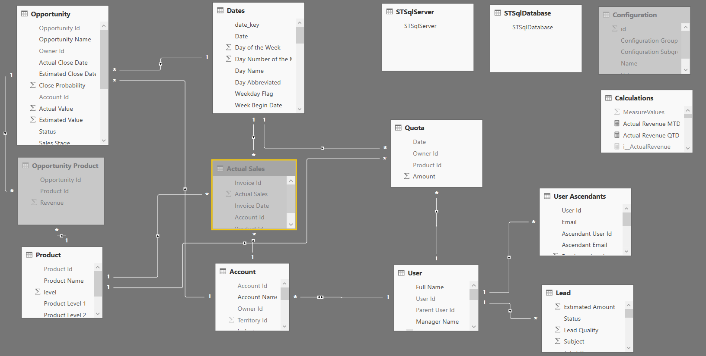

### Power BI Measures
The table below lists the measures in the Power BI file:

|Measure | Description |
|--------|-------------|
| Actual Revenue | Sum of actual revenue |
| Actual Revenue (cumul) | A cumulative sum of actual revenue |
| Actual Revenue MTD | Sum of actual revenue from the beginning of the month until today |
| Actual Revenue QTD | Sum of actual revenue from the beginning of the quarter until today |
| Actual Revenue YTD | Sum of actual revenue from the beginning of the year until today |
| Expected Revenue (cumul) | A cumulative sum of actual and open revenue  |
| Expected Revenue | A sum of actual and open revenue |
| Lost Opportunity Count | Count of lost opportunities  |
| Open Revenue | Sum of open revenue |
| Open Revenue (cumul) | A cumulative sum of open revenue |
| Pipeline Coverage % | The ratio between expected revenue and target |
| Pipeline Gap | The difference between expected revenue and quota expressed in $ |
| Quota | Sum of quota |
| Quota (cumul) | Cumulative sum of quota |
| Variance to Quota | The difference between actual revenue and quota expressed in $ |
| Variance to Quota % | The difference between actual revenue and quota expressed as a % |
| Win Ratio | The ratio between open opportunities and all open and closed opportunities (won + lost) |
| Won Opportunity Count | Count of won opportunity |
| YOY Growth | Percentage change in YTD actual revenue vs. the same period last year |
| YOY Month Growth | Percentage change in MTD actual revenue vs. the same period last year |
| YOY Quarter Growth | Percentage change QTD actual revenue vs. the same period last year |

## Power BI Calculated Columns

| Table | Column | Description |
|-------|--------|-------------|
| Account | Account Link | URL for account in Dynamics 365. Populated if the BaseURL is populated in the configuration table.|
| Date | Fiscal Day Number	The day of the fiscal year |
| | Fiscal Month Name | Name of the fiscal month |
| | Fiscal Month Number	 |  |
| | Fiscal Quarter | Fiscal quarter in format of of FYyy Qq, eg, FY17 Q2 |
| | Fiscal Quarter Number	 |  |
| | Fiscal Week | Numeric fiscal week from 1 to 52 |
| | Fiscal Year | Four digit fiscal year |
| Opportunity | Close Date | The estimated or actual close date (depending on whether the opportunity is open or closed)
| | Opportunity Link | Link back to Opportunity in Dynamics 365. Populated if the BaseURL is populated in the configuration table.
| User | Org Level 1 | Highest level parent of the current user in the reporting hierarchy.
| | Org Level 2      | Second highest level parent of the current user in the reporting hierarchy
| | Org level 3      | Third highest parent of current user.
| | Org Level 4      | Fourth highest parent of current user.
| | Path             | Comma separated list of all parents of the current user starting with the highest and continuing until the current.

# Sales Management for Dynamics 365 Pricing

For a detailed breakdown of Azure Key Vault costs you can refer to the [Key Vault Pricing Calculator](https://azure.microsoft.com/en-us/pricing/details/key-vault/)

For a detailed breakdown of Azure SQL costs you can refer to the [SQL Database Pricing Calculator](https://azure.microsoft.com/en-us/pricing/details/sql-database)

For a detailed breakdown of Azure Analysis Services costs you can refer to the [SQL Database Pricing Calculator](https://azure.microsoft.com/en-us/pricing/details/sql-database)