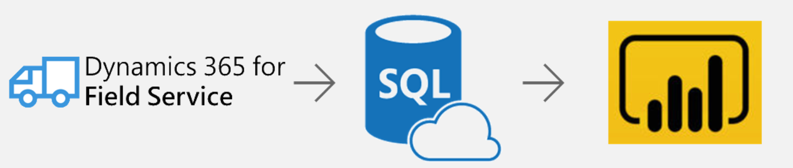
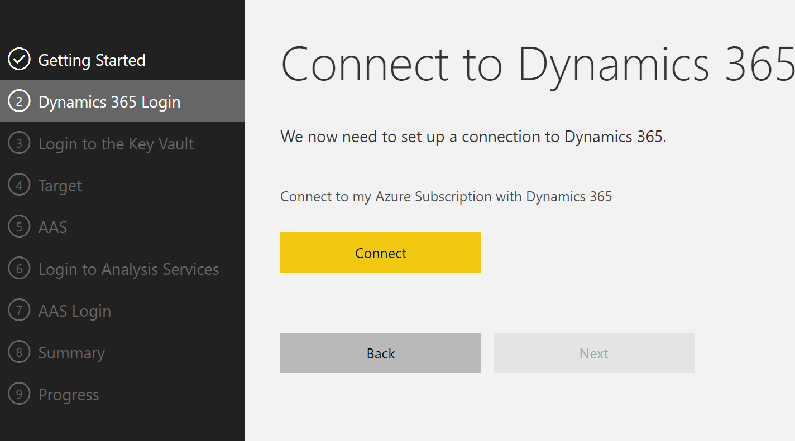
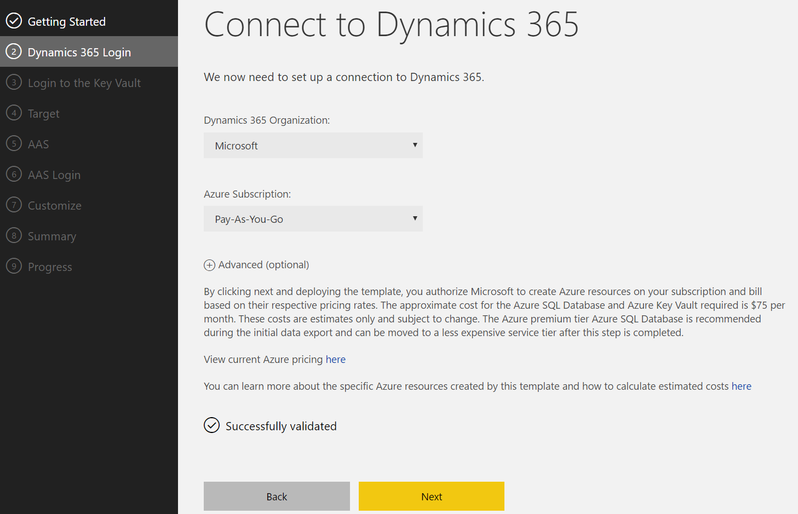
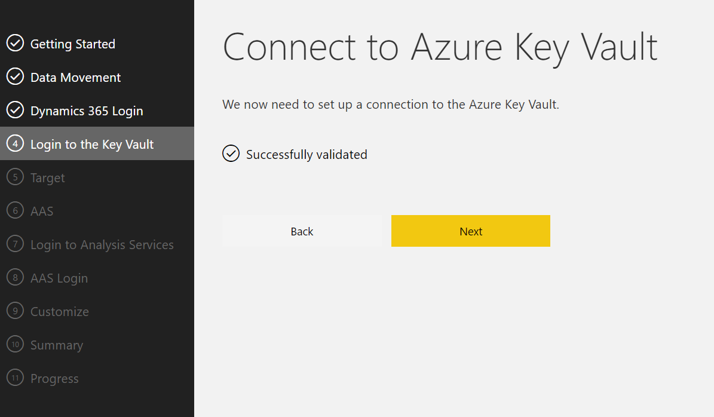
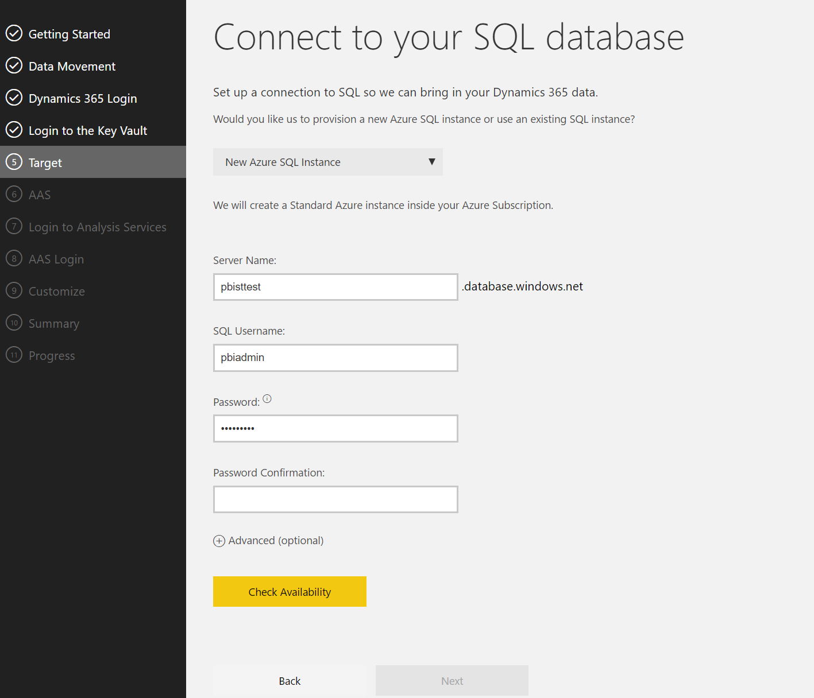
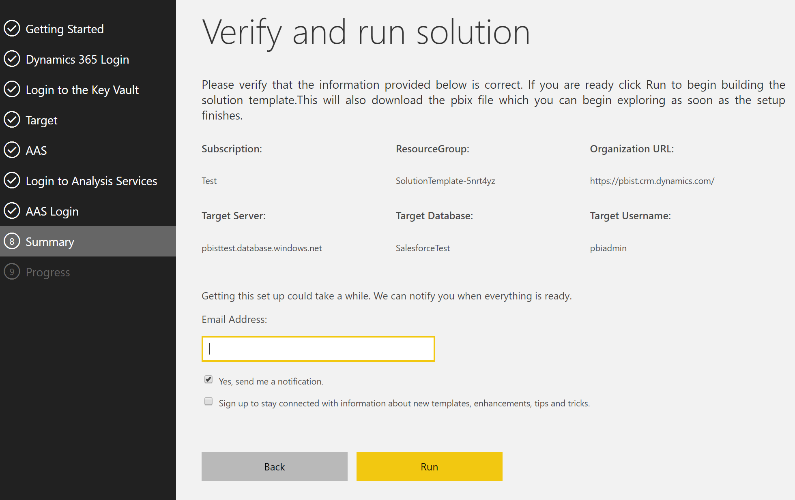
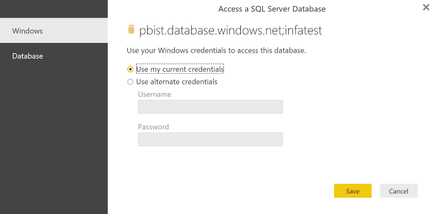

# Power BI Dynamics 365 Customer Service Solution Template Documentation
# Table of Contents
1. [Introduction](#introduction)
2. [Architecture](#architecture)
3. [System Requirements](#system-requirements)
4. [How to Install](#how-to-install)
5. [Technical Description](#technical-description)

# Introduction
Create a scalable, secure and flexible PowerBI dashboard on Dynamics 365 with the Power BI Customer Service solution template for Dynamics 365. The template creates everything required for an end-to-end analytics solution on your Dynamics 365 org including the data extraction, database constructs, and a Power BI report bound to the database. You can extend or customize the result to accommodate your own business requirements.
The Customer Service solution template for Dynamics 365 is intended for customers who:
-	Want to provision an analytics solution for tens or even thousands of users
-	Want to deploy an analytics solution that scales with any size of Dynamics 365 instance from small to very large
-	Want to be able to create data mashups on Dynamics 365 with data from their ERP, marketing, inventory management or other any other application
The Customer Service solution template for Dynamics 365 is targeted at sales executives, managers and salespeople to forecast revenue, compare sales to the same period in the prior month, quarter or year, track sales against goals and monitor their pipeline .
This document describes how to provision the Customer Service solution template for Dynamics 365, the architecture, and how to extend or customize the template. The audience for this document is intended to be the IT professional or administrator who implements and manages the solution template and/or the developer who extends or customizes the solution template.
Please contact <PBISolnTemplates@microsoft.com> for any questions or issues with this document.

# Architecture

All that is required is an Azure subscription (athough an existing Azure SQL DB can be used if available.)
This has all the advantages of Software as a Service where you pay as you go. All the patching and upkeep is handled for you. You can also later publish your reports to PowerBi.com.

Data Export Services pushes new and changed records from Dynamics 365 to populate a destination database (how data is pulled and SQL database are described in later sections) after which the approach differs.

# System Requirements
Setting up the template requires the following:
-	an Azure Subscription
-	Power BI Desktop (latest version)
-	Power BI Pro (to share the template with others)
-	Customer Service for Dynamics 365 2015 or later.

**You must have administrative permissions on your Dynamics 365 for Customer Service instance**. You can check whether you are a system administrator
 [here](https://www.microsoft.com/en-us/dynamics/crm-customer-center/find-your-dynamics-365-administrator-or-support-person.aspx). 

# How to Install
Installing the Customer Service solution template for Dynamics 365 configures the following:
-	Data extraction
-	Azure SQL Database
-	Power BI Desktop file
The detailed description of each component of the architecture is below. To get started, navigate to the Power BI solution templates from the Solutions menu on powerbi.com: 

From there, select the Customer Service for Dynamics 365 solution template and click the “Install now” button.

## Step 1: Connect to Dynamics 365 Online

Next, connect to your Dynamics 365 instance to give permission to the provisioning application to set up data export service to populate the Azure SQL DB destiniation.

**Note: You must have an Azure subscription in the same tenant as Dynamics 365.** 

An Azure subscription grants you access to Windows Azure services and is the means by which resource usage is reported and services are billed.
A tenant is a representation of an organization in Azure. It is also called a dedicated instance of Azure Active Directory. You may have an Azure subscription already, but it must be in the same tenant as your Sales for Dynamics 365 instance to be used for the solution template. To see if you have an Azure subscription in the same tenant:

-	connect to the Azure portal (https://portal.azure.com) using the same credentials you connect to Sales for Dynamics 365.
-	On the left panel, click the “Subscriptions” item.
If you see a subscription on the right panel, you satisfy this requirement. If no subscription exists, it is simple, fast and free to create one.
by following the instructions here: <https://account.windowsazure.com/subscriptions/>. 

## Step 2: Specify Azure Subscription

Choose the Dynamics 365 organization and specify the Azure subscription used to contains newly created resources.

Optionally change the name of the Azure Resource Group (to better manage your AzurE resource consumption.)

Click "Next".

## Step 3: Set up Azure Key Vault

Azure Key Vault is a secure mechanism to store credentials to Azure SQL DB. The next step creates an Azure Key valut instance.

Click “Next” to continue.

## Step 4: Connect to new or existing Azure SQL DB
Connect to an existing SQL Server or provide details which the application will use to spin up an Azure SQL on your behalf. Only Azure SQL is supported for this template. If a user chooses to spin up a new Azure SQL, this will get deployed in their Azure subscription inside the newly created resource group.

Open the advanced tab to change the service tier of the destination Azure SQL Database or datacenter location.

**_Important note_**: If you use an existing Azure SQL DB, you **_must_** safelist your client IP address shown on this page in the Azure portal before you continue.
If you do not, you will not be able to read data from Azure SQL DB to populate the Power BI file. To safe-list the IP addresses, follow the instructions [here](https://azure.microsoft.com/en-us/documentation/articles/sql-database-configure-firewall-settings/).

Click “Next” to continue.

## Step 5: Summary
Review your selections. Enter a valid email address to receive a notification when the solution template has completed provisioning. 

The base Dynamics 365 URL is provided for links for each Customer Service object in the power BI reports.

Provide an email to be contacted when the initial data publication is complete. There is no schedule to refresh data - it is replicated in realtime.

Click “Next” to continue.

## Step 6: Track Progress
Once data starts moving, A Power BI file can be downloaded that is bound to the database specified earlier. 

A zip file ccan be downloaded that contains three Power BI desktop files (or pbix files) pre-bound to the data destination (either Azure SQL Server or Azure Analysis Services). Follow the instructions on the first page in the report to show your data.

## Step 7: Open the Power BI file

Open the downloaded Power BI file. For implementations without Azure AS, take the following steps:
a)	Click “Apply Changes”

b)	Windows Credentials
On the windows tab, select “Use my current credentials”:

c)	Database Credentials
Click the Database item in the left-hand pane and enter the username and password you provided for the Azure SQL database:

Click “Save”.

For implementations with Azure AS, simply refresh the power BI report and use your current credentials.

## Step 8: View the Report
At this point Power BI Desktop will connect and retrieve the data. Note that it may take some time for the initial data pull to finish.  

## Common Provisioning Questions
**I closed the “Track your Progress” page. How do I know when the data has been pulled out of Dynamics 365?**
you will receive an email when the data has completed moving.

**I didn’t download the Power BI file (the pbix file) but closed the “Track your Progress” page where it is downloaded from. Now what?**
You can repeat the provisioning process or find the pbix files [here](https://github.com/Microsoft/BusinessPlatformApps/blob/dev/Source/Apps/Microsoft/Released/Microsoft-PSA/Service/PowerBI/CustomerService.pbix).

# Technical Description
This section describes each component of the solution template in detail.

## Data Extraction and Load
The Customer Service solution template utilizes Data Export Services to replicate the following tables::
-	account
-	appointment
-   AttributeMetadata
-	contact
-	email
-	fax
-   GlobalOptionSetMetadata
-	incident
-	letter
-	msdyn_survey
-	msdyn_surveyresponse
-   msdyn_OptionSetMetadata
-   phonecall
-   slakpiinstance
-   StateMetadata
-   StatusMetadata
-   systeuser
-   TargetMetadata
-   task
-   team

The tables are replicated with custom fields already included.

Additional entities can be replicated to the target database. 

### Date

The Date table is autogenerated with the installation of the solution template from 2013 to 2020.

| Column         | Datatype     | Description |
| ---------------|--------------|--------------|
| date_key      | 	int	      | Numeric datekey in the format yyyymmdd |
| full_date      | 	date	      |  |
| day_of_week      | 	tinyint	      | Day of week – 1 though 7 |
| day_num_in_month      | 	tinyint      | 	Day of month – 1 through 31 |
| day_name      | 	char(9)      | The day name. can be edited to localize |
| day_abbrev      | 	char(3)      | 	Day abbreviation; eg, Mon for Monday |
| weekday_flag      | 	char(1)      | 	y for weekday, n for weekend |
| week_num_in_year      | 	tinyint      | 	Week numer in year ranging from 1 to 52 |
| week_begin_date      | 	date      | 	The date of the beginning of the week for the current date |
| week_begin_date_key      | 	int      | 	The date key of the beginning of the week for the current date |
| month      | 	tinyint      | Month number raning from 1 through 12. |
| month_name      | 	char(9)      | 	Long month name; eg, January |
| month_abbrev      | 	char(3)	      | Short month name; eg, Jan |
| quarter      | 	tinyint	      | Calendar quarter number, from 1 through 4 |
| year	      | smallint       | Year number; eg, 2017 |
| yearmo      | 	int      | Year  and month number; eg, 201703 for March, 2017 |
| last_day_in_month_flag      | 	char(1)      | Set to n if not the last day in the calendar month, set to y for last day in calendar month. |
| same_day_year_ago_date      | 	date      |  |
| same_day_year_ago_key      | 	int	      |  |
| day_num_in_year      | expression      | 	Number of the current day in the calendar year. |
| quarter_name      | 	expression      | 	Name of the current calendar quarter; eg, Q1 |

# Customer Service for Dynamics 365 Pricing

For a detailed breakdown of Azure Key Vault costs you can refer to the [Key Vault Pricing Calculator](https://azure.microsoft.com/en-us/pricing/details/key-vault/)

For a detailed breakdown of Azure SQL costs you can refer to the [SQL Database Pricing Calculator](https://azure.microsoft.com/en-us/pricing/details/sql-database)

For a detailed breakdown of Azure Analysis Services costs you can refer to the [SQL Database Pricing Calculator](https://azure.microsoft.com/en-us/pricing/details/sql-database)