How to set up a Facebook Application and Developer Account
===========================================================

#### Step 1 - Go to the Facebook developer getting started page
go to https://developers.facebook.com/docs/apps/register#developer-account 
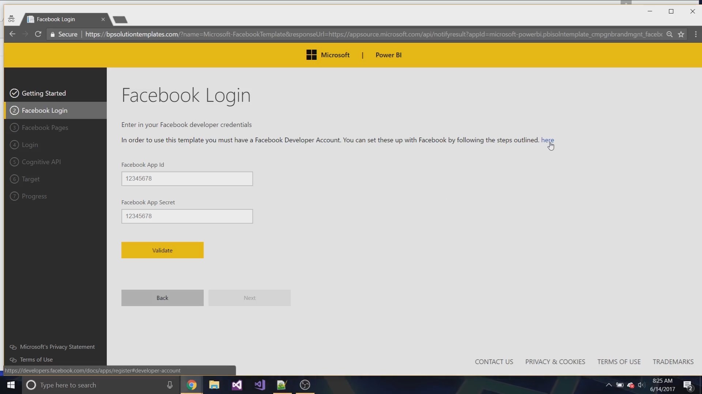

#### Step 2 - Click login to Facebook
Click 1, login to Facebook
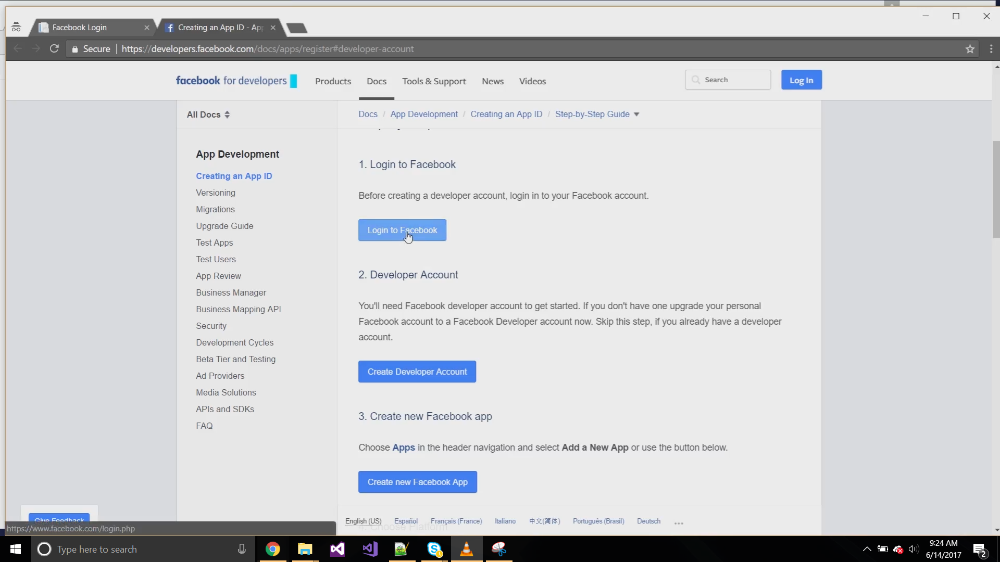

#### Step 3 - Enter in your Facebook credentials
If you do not have a Facebook account, you can click sign up to create a new account.
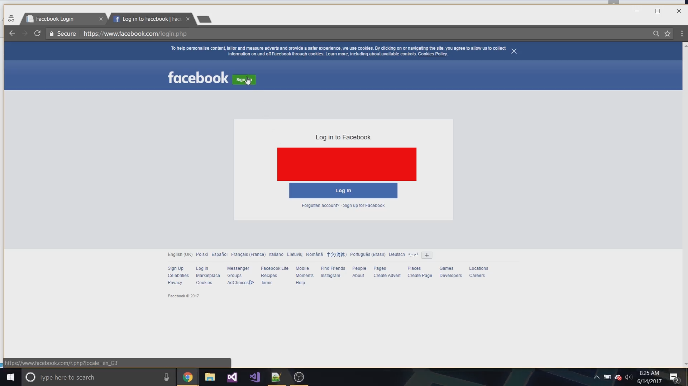

#### Step 4 - After Sucessfull Login go back to the developer portal
Once you have logged in, navigate back to the developer portal. https://developers.facebook.com/docs/apps/register#developer-account 
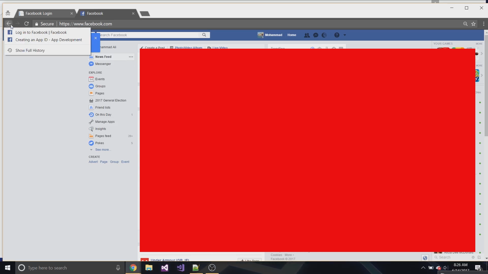

#### Step 5 - Click Create Developer Account
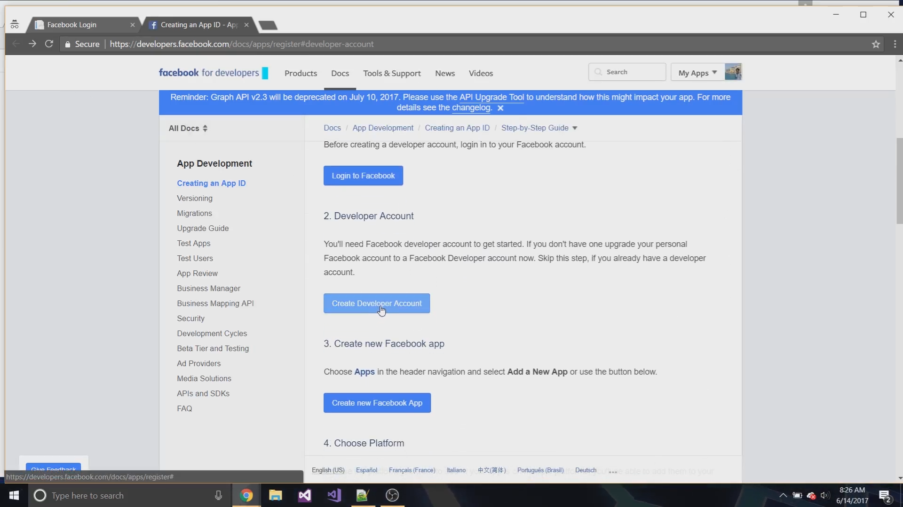

#### Step 6 - Click Register
you will need to accept the terms before the register button becomes available
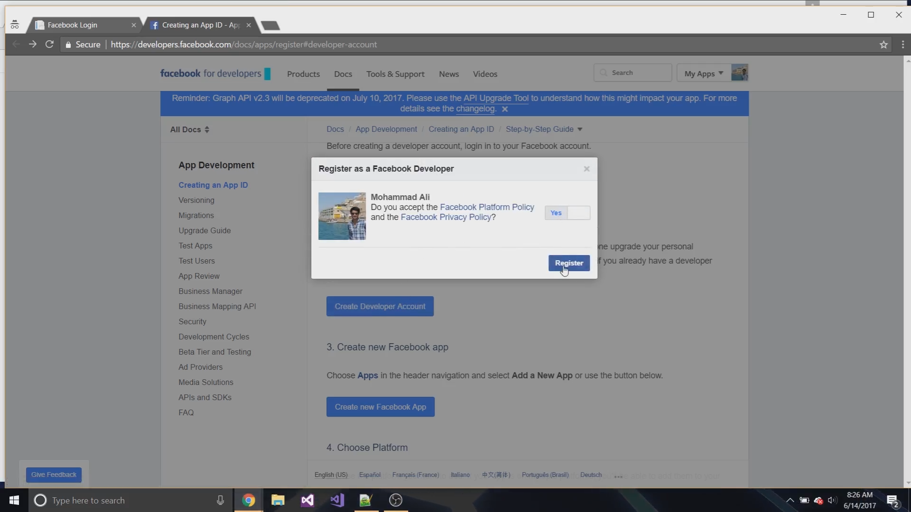

#### Step 7 - Click Create App Id
Click create App Id
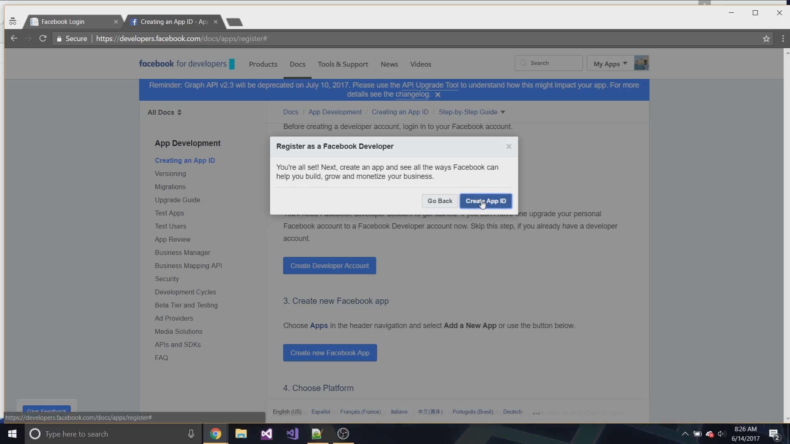

#### Step 8 - Choose a name for your application
This name can be anything you would like it to be
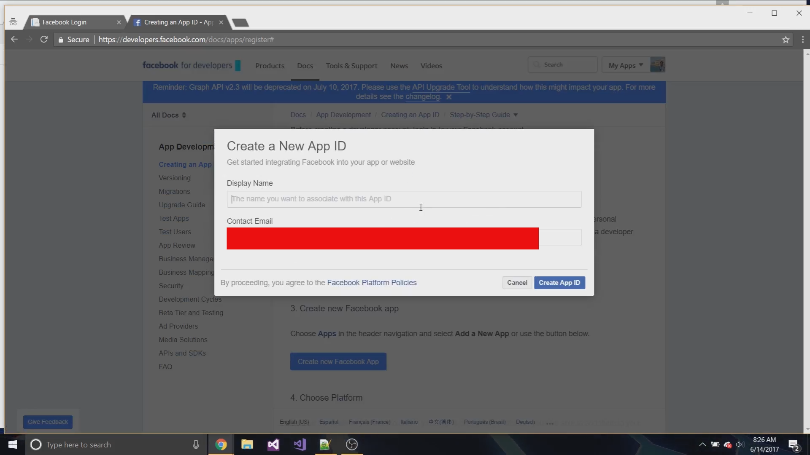

#### Step 9 - Click dashboard
After the sucessfull creation, you will redirected to the app home page, clikc dashboard to see your app id and secret
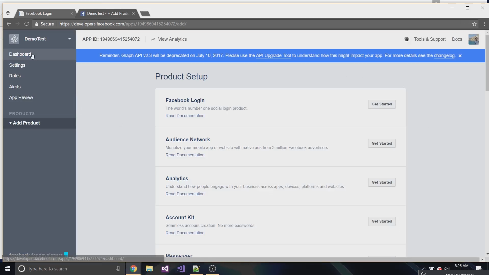

#### Step 10 - Copy your App Id and Secret
the App Id is the number that starts with 15, the App Secret is hidden by default. cliick show and copy that into the solution template page
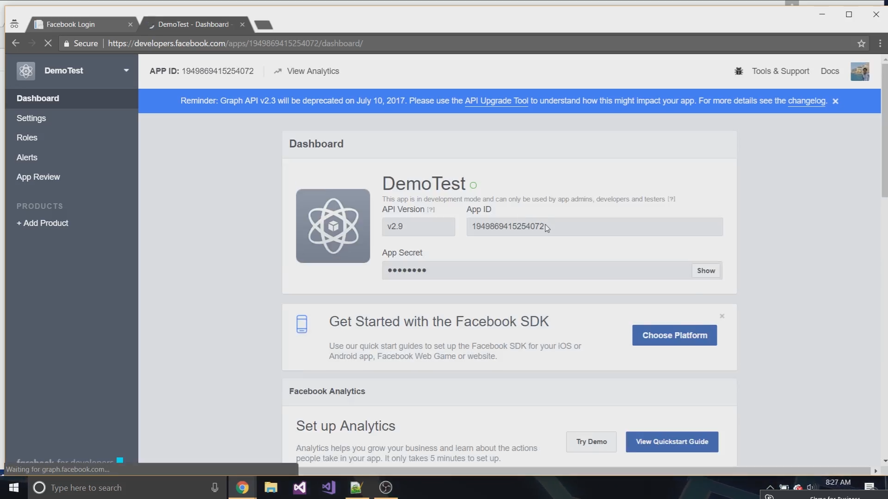

#### Step 11 - Click validate to confirm everything is correct
click next once you have completed this
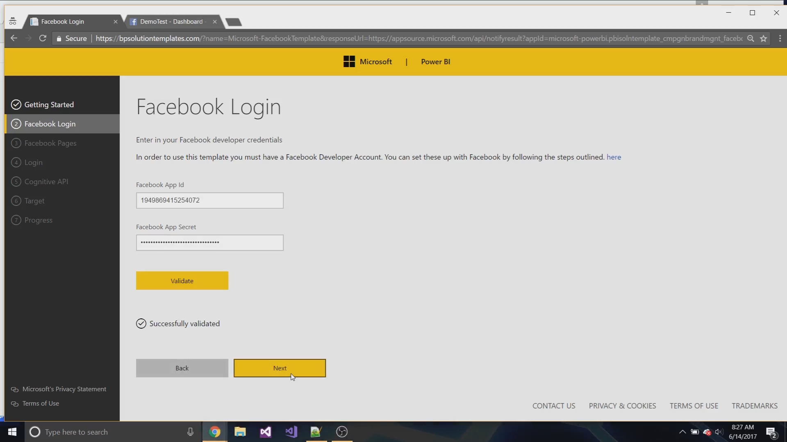

For a video walkthrough, please go to https://www.youtube.com/watch?v=AEzHk_O1RK4

