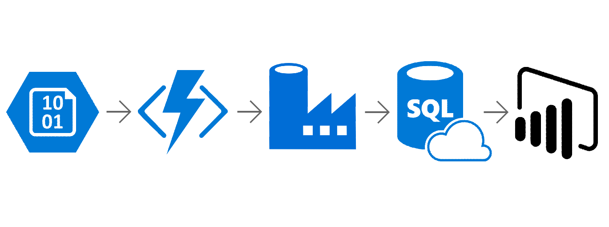

Azure IoT Central Analytics Solution Template Documentation
===========================================================

# Table of Contents

1. [Introduction](#introduction)
1. [How this works](##how-this-works)
1. [Prerequisites](#prerequisites)
1. [How to set up](#how-to-set-up)
1. [Architecture](#architecture)
1. [Power BI report walkthrough](#power-bi-report-walkthrough)
1. [Estimated costs](#estimated-costs)

## Introduction

Create a powerful Power BI dashboard to monitor the performance of your IoT devices in Azure IoT Central with this Power BI solution template. In your Power BI dashboard, you can:

- Track how much data your devices are sending over time
- Compare data volume between telemetry, states, and events
- Identify devices that are reporting lots of measurements
- Observe historical trends of device measurements
- Identify problematic devices that send lots of critical events

## How this works
After setting up [continuous data export](https://aka.ms/iotcentraldocscontinousdataexport), the messages your devices send to IoT Central get exported periodically to your Azure Blob Storage account. The data that sits in Blob Storage looks like distinct files in AVRO format. This solution template transforms this data and loads it into SQL tables to be visualized in a Power BI dashboard. The dashboard is live, so as your devices send more data, you can hit refresh to see new data.

> Note: Only the data that is exported to your Blob storage from the moment when you complete setting up this solution template onwards will appear in your Power BI dashboard. Historical data previously exported will not be processed or inserted into the SQL database, so it will not be shown in the dashboard. 

The following document provides a walkthrough of the architecture, a deep dive into every component, comments on customizability as well as information on additional topics like estimated costs. For any questions not covered in this document, please contact the team at <PBISolnTemplates@microsoft.com>

## Prerequisites

Setting up the template requires the following:

- Access to an Azure subscription

- Exported data using [continuous data export](https://aka.ms/iotcentraldocscontinuousdataexport) from your IoT Central app. We recommend you turn on measurements, devices, and device template streams to get the most out of the Power BI dashboard.

- Power BI Desktop (latest version)

- Power BI Pro (to share the template with others)

## How to set up

Before diving into the components of the solution, we will go through how to set things up. To get started with the solution, navigate to the Azure IoT Central Analytics template page and click **Install Now**.

**Getting Started:** Starting page introducing the template and explaining the architecture.

**Login:** Choose between signing into an organizational account and a Microsoft (work/school) account to connect to Azure.

If you select a Microsoft account, you will need to provide the application with a domain directory. You can find your domain by logging into the Azure portal and choosing from those listed when you click your e-mail in the top right hand corner.

Logging into Azure gives the application access to your Azure subscription and lets us spin up Azure services on your behalf. If you want a more granular breakdown of the costs, see [estimated costs](#estimated-costs).

Pick your Azure subscription to provision the Azure services under. In the Advanced tab, you can change the Resource Group name and location from the default values. When you click "Next", a new resource group will be spun up under your Azure subscription.

**Connect to Azure Blob Storage:** Select the storage account and container in your Azure subscription where your IoT Central data has been exported to.

**Database:** Connect to an existing Azure SQL Server or provide details to create a new SQL Server on your behalf. If you choose to create a new SQL Server, this will get deployed in your Azure subscription inside the newly created resource group.

**Summary:** Summary page outlining all the new resources to be created and existing resources to connect to.

**Deploy:** SQL scripts run to create and connect the Azure Functions and Azure Data Factory resources into your resource group.

**It is important that you do not navigate away from this page while deployment takes place.** Once everything gets deployed a download link will appear for a Power BI file which consists of the pre-defined reports.

## Architecture

All of the resources that have been created can be accessed in the Azure portal. Everything should be under one resource group (unless a user was using an existing SQL server. In this case the SQL Server will appear in whatever resource group it already existed in).

The specifics of each resource and how it gets used is described below.

### Azure Functions
The Azure Function app gets triggered each time a new file is written to Blob storage. The functions extract the fields within each measurements, devices, and device templates file and populates several intermediate SQL tables to be used by Azure Data Factory.

### Azure Data Factory
Azure Data Factory connects to the SQL database as a linked service. It runs stored procedure activities which process the data and store it in the analysis tables.

### Azure SQL Database
These tables are automatically created for you. Click the table name to jump to its schema below.

| Table name |
|------------|
|[[analytics].[Measurements]](####[analytics].[Measurements])|
|[[analytics].[Messages]](####[analytics].[Messages])|
|[[stage].[Measurements]](####[stage].[Measurements])|
|[[analytics].[Properties]](####[analytics].[Properties])|
|[[analytics].[PropertyDefinitions]](####[analytics].[PropertyDefinitions])|
|[[analytics].[MeasurementDefinitions]](####[analytics].[MeasurementDefinitions])|
|[[analytics].[Devices]](####[analytics].[Devices])|
|[[analytics].[DeviceTemplates]](####[analytics].[DeviceTemplates])|
|[[dbo].[date]](####[dbo].[date])|
|[[dbo].[ChangeTracking]](####[dbo].[ChangeTracking])|

#### [analytics].[Measurements]
| Column Name | Data type | Nullable |
|-------------|-----------|----------|
|id|int|No|
|messageId|uniqueidentifier|No|
|deviceId|nvarchar(200)|No|
|deviceTemplate|nvarchar(101)|Yes|
|measurementDefinition|nvarchar(357)|Yes|
|timestamp|datetime|No|
|numericValue|decimal(30, 10)|Yes|
|stringValue|nvarchar(MAX)|Yes|
|booleanValue|bit|Yes|

#### [analytics].[Messages]
| Column Name | Data type | Nullable |
|-------------|-----------|----------|
|id|uniqueidentifier|No|
|deviceId|nvarchar(200)|No|
|timestamp|datetime|No|
|Size|int|No|

#### [stage].[Measurements]
| Column Name | Data type | Nullable |
|-------------|-----------|----------|
|id|int|No|
|messageId|uniqueidentifier|No|
|deviceId|nvarchar(200)|No|
|timestamp|datetime|No|
|field|nvarchar(255)|No|
|numericValue|decimal(30, 10)|Yes|
|stringValue|nvarchar(MAX)|Yes|
|booleanValue|bit|Yes|

#### [analytics].[Properties]
| Column Name | Data type | Nullable |
|-------------|-----------|----------|
|id|nvarchar(507)|No|
|deviceId|nvarchar(200)|No|
|deviceTemplate|nvarchar(101)|No|
|propertyDefinition|nvarchar(408)|No|
|timestamp|datetime|No|
|numericValue|decimal(30, 10)|Yes|
|stringValue|nvarchar(MAX)|Yes|
|booleanValue|bit|Yes|

#### [analytics].[PropertyDefinitions]
| Column Name | Data type | Nullable |
|-------------|-----------|----------|
|id|nvarchar(408)|No|
|deviceTemplate|nvarchar(101)|No|
|field|nvarchar(255)|No|
|kind|nvarchar(50)|No|
|dataType|nvarchar(100)|No|
|name|nvarchar(200)|No|
|timestamp|datetime|No|

#### [analytics].[MeasurementDefinitions]
| Column Name | Data type | Nullable |
|-------------|-----------|----------|
|id|nvarchar(357)|No|
|deviceTemplate|nvarchar(101)|No|
|field|nvarchar(255)|No|
|kind|nvarchar(50)|No|
|dataType|nvarchar(100)|Yes|
|name|nvarchar(200)|No|
|category|nvarchar(100)|Yes|
|timestamp|datetime|No|

#### [analytics].[Devices]
| Column Name | Data type | Nullable |
|-------------|-----------|----------|
|deviceId|nvarchar(200)|No|
|deviceTemplate|nvarchar(101)|No|
|name|nvarchar(200)|No|
|simulated|bit|No|
|timestamp|datetime|No|

#### [analytics].[DeviceTemplates]
| Column Name | Data type | Nullable |
|-------------|-----------|----------|
|id|nvarchar(101)|No|
|deviceTemplateId|nvarchar(50)|No|
|deviceTemplateVersion|nvarchar(50)|No|
|name|nvarchar(1000)|No|
|timestamp|datetime|No|

#### [dbo].[date]
| Column Name | Data type | Nullable |
|-------------|-----------|----------|
|date_key|int|No|
|full_date|date|No|
|day_of_week|tinyint|No|
|day_num_in_month|tinyint|No|
|day_name|nvarchar(50)|No|
|day_abbrev|nvarchar(10)|No|
|weekday_flag|char(1)|No|
|week_num_in_year|tinyint|No|
|week_begin_date|date|No|
|month|tinyint|No|
|month_name|nvarchar(50)|No|
|month_abbrev|nvarchar(10)|No|
|quarter|tinyint|No|
|year|smallint|No|
|yearmo|int|No|
|same_day_year_ago_date|date|No|

#### [dbo].[ChangeTracking]
| Column Name | Data type | Nullable |
|-------------|-----------|----------|
|TABLE_NAME|nvarchar(255)|Yes|
|SYS_CHANGE_VERSION|bigint|Yes|

## Power BI report walkthrough
Two reports are generated for you automatically. 

The first report shows a historical view of measurements reported by devices, and breaks down the different types of measurements and devices that have sent the highest number of measurements.

The second report dives deeper into events and shows a historical view of errors and warnings reported. It also shows which devices are reporting the highest number of events all up, as well as specifically error events and warning events.

## Estimated costs

Here is an estimate of the Azure costs (Azure Function, Data Factory, Azure SQL) involved. All prices are in USD. Keep in mind that prices vary by region, so you should always look up the latest prices of the individual services to get the actual prices.

The following defaults are set for you in the template (you can modify any of these after things get set up):

-   Azure Functions: Consumption plan - depends on frequency and amount of data being exported to Azure Blob storage, for Contoso app, approximately free

-   Azure Data Factory: 2 activities every 15 minutes - ~$3/month

-   Azure SQL: Standard S1 - ~$30/month

Whilst the default setting should cater to most IoT Central Analysis solution template requirements, we encourage you to familiarize yourself with the various pricing options and tweak things to suit your needs.
