# Power BI Project Service Automation Solution Template for Dynamics 365 Documentation
# Table of Contents
1. [Introduction](#introduction)
2. [Architecture](#architecture)
3. [System Requirements](#system-requirements)
4. [How to Install](#how-to-install)
5. [Technical Description](#technical-description)
6. [Report Walkthrough](#report-walkthrough)

# Introduction
Create a scalable, secure and flexible PowerBI dashboard on Dynamics 365 with the Power BI Project Service Automation solution template for Dynamics 365. The template creates everything required for an end-to-end analytics solution on your Dynamics 365 org including the data extraction, database constructs, and a Power BI report bound to the database. You can extend or customize the result to accommodate your own business requirements.
The Project Service Automation solution template for Dynamics 365 is intended for customers who:
-	Want to provision an analytics solution for tens or even thousands of users
-	Want to deploy an analytics solution that scales with any size of Dynamics 365 instance from small to very large
-	Want to be able to create data mashups on Dynamics 365 with data from their ERP, marketing, inventory management or other any other application
The Project Service Automation solution template for Dynamics 365 is targeted at sales executives, managers and salespeople to forecast revenue, compare sales to the same period in the prior month, quarter or year, track sales against goals and monitor their pipeline .
This document describes how to provision the Project Service Automation solution template for Dynamics 365, the architecture, and how to extend or customize the template. The audience for this document is intended to be the IT professional or administrator who implements and manages the solution template and/or the developer who extends or customizes the solution template.
Please contact <PBISolnTemplates@microsoft.com> for any questions or issues with this document.

# Architecture

All that is required is an Azure subscription (athough an existing Azure SQL DB can be used if available.)
This has all the advantages of Software as a Service where you pay as you go. All the patching and upkeep is handled for you. You can also later publish your reports to PowerBi.com.

Data Export Services pushes new and changed records from Dynamics 365 to populate a destination database (how data is pulled and SQL database are described in later sections) after which the approach differs.

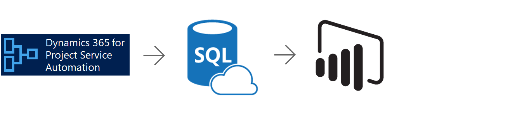

# System Requirements
Setting up the template requires the following:
-	an Azure Subscription
-	Power BI Desktop (latest version)
-	Power BI Pro (to share the template with others)
-	Project Service Automation for Dynamics 365 2015 or later, on-premises or Online.

**You must have administrative permissions on your Dynamics 365 for Project Service Automation instance**. You can check whether you are a system administrator
 [here](https://www.microsoft.com/en-us/dynamics/crm-customer-center/find-your-dynamics-365-administrator-or-support-person.aspx). 

# How to Install
Installing the Project Service Automation solution template for Dynamics 365 configures the following:
-	Data extraction
-	Azure SQL Database
-	Power BI Desktop file
The detailed description of each component of the architecture is below. To get started, navigate to the Power BI solution templates from the Solutions menu on powerbi.com: 

From there, select the Project Service Automation for Dynamics 365 solution template and click the “Install now” button.

## Step 1: Connect to Dynamics 365 Online

Next, connect to your Dynamics 365 instance to give permission to the provisioning application to set up data export service to populate the Azure SQL DB destiniation.

**Note: You must have an Azure subscription in the same tenant as Dynamics 365.** 

An Azure subscription grants you access to Windows Azure services and is the means by which resource usage is reported and services are billed.
A tenant is a representation of an organization in Azure. It is also called a dedicated instance of Azure Active Directory. You may have an Azure subscription already, but it must be in the same tenant as your Sales for Dynamics 365 instance to be used for the solution template. To see if you have an Azure subscription in the same tenant:

-	connect to the Azure portal (https://portal.azure.com) using the same credentials you connect to Sales for Dynamics 365.
-	On the left panel, click the “Subscriptions” item.
If you see a subscription on the right panel, you satisfy this requirement. If no subscription exists, it is simple, fast and free to create one.
by following the instructions here: <https://account.windowsazure.com/subscriptions/>. 

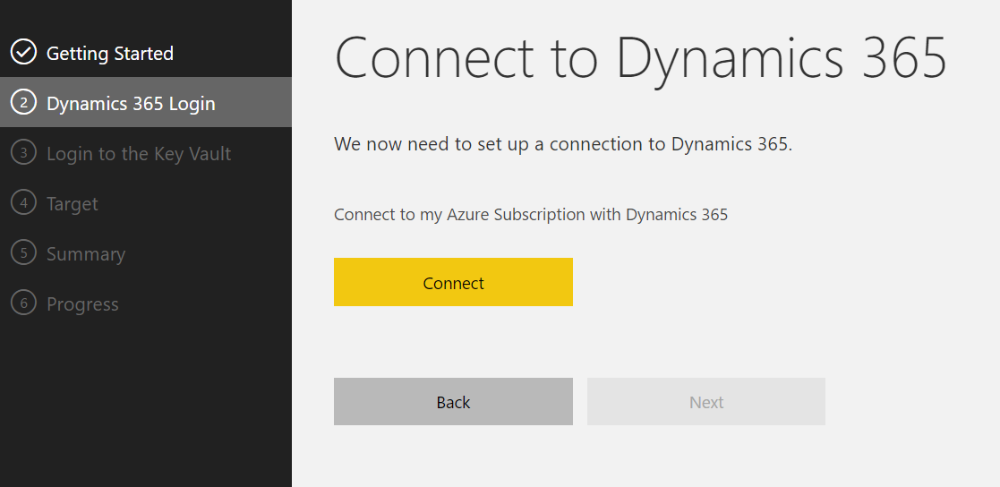

## Step 2: Specify Azure Subscription

Choose the Dynamics 365 organization and specify the Azure subscription used to contains newly created resources.
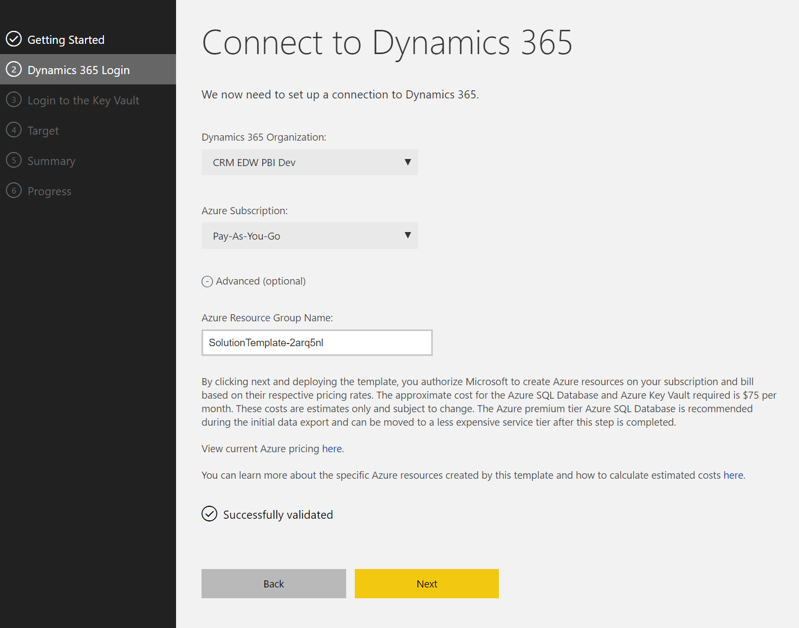

Optionally change the name of the Azure Resource Group (to better manage your AzurE resource consumption.)

Click "Next".

## Step 3: Set up Azure Key Vault

Azure Key Vault is a secure mechanism to store credentials to Azure SQL DB. The next step creates an Azure Key valut instance.

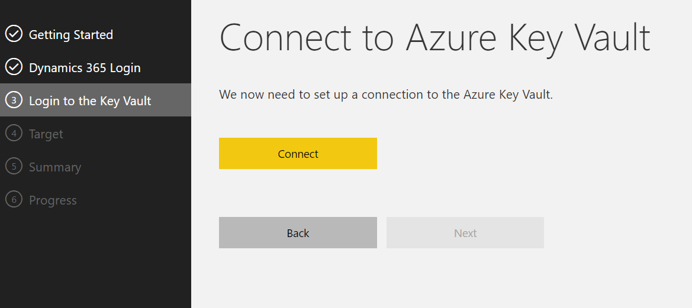

Click “Next” to continue.

## Step 4: Connect to new or existing Azure SQL DB
Connect to an existing SQL Server or provide details which the application will use to spin up an Azure SQL on your behalf. Only Azure SQL is supported for this template. If a user chooses to spin up a new Azure SQL, this will get deployed in their Azure subscription inside the newly created resource group.
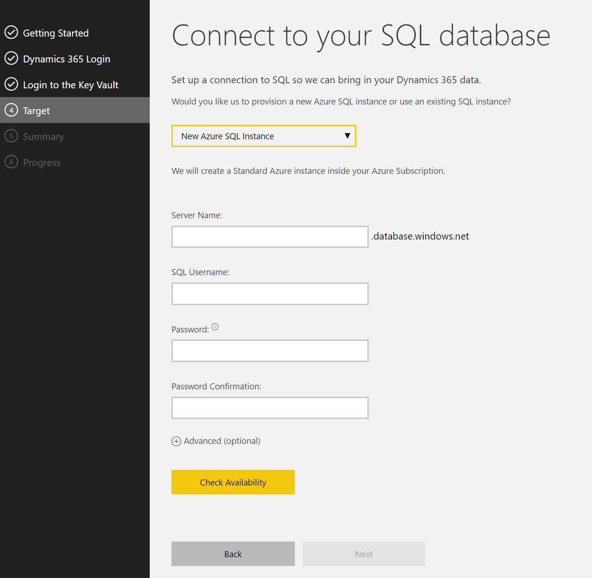

Open the advanced tab to change the service tier of the destination Azure SQL Database or datacenter location.

**_Important note_**: If you use an existing Azure SQL DB, you **_must_** safelist your client IP address shown on this page in the Azure portal before you continue.
If you do not, you will not be able to read data from Azure SQL DB to populate the Power BI file. To safe-list the IP addresses, follow the instructions [here](https://azure.microsoft.com/en-us/documentation/articles/sql-database-configure-firewall-settings/).

Click “Next” to continue.

## Step 5: Summary
Review your selectionms. Enter a valid email address to receive a notification when the solution template has completed provisioning. 

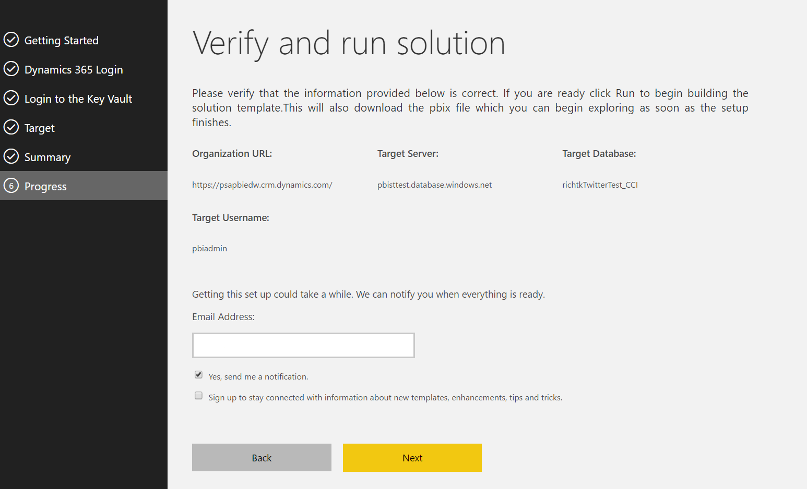

The base Dynamics 365 URL is provided for links for each Project Service Automation object in the power BI reports.

Provide an email to be contacted when the initial data publication is complete. There is no schedule to refresh data - it is replicated in realtime.

Click “Next” to continue.

## Step 6: Track Progress
Once data starts moving, A Power BI file can be downloaded that is bound to the database specified earlier. 
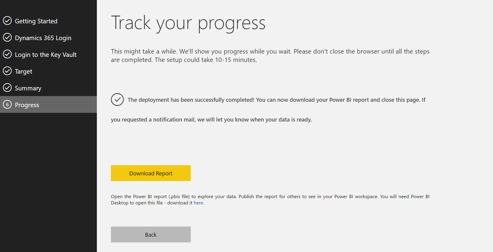

A zip file ccan be downloaded that contains three Power BI desktop files (or pbix files) pre-bound to the data destination (either Azure SQL Server or Azure Analysis Services). Follow the instructions on the first page in the report to show your data.

## Step 7: Open the Power BI file

Open the downloaded Power BI file and take the following steps:
a)	Click “Apply Changes”
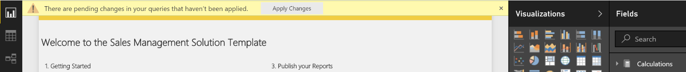
b)	Windows Credentials
On the windows tab, select “Use my current credentials”:

c)	Database Credentials
Click the Database item in the left-hand pane and enter the username and password you provided for the Azure SQL database:

Click “Save”.

## Step 8: View the Report
At this point Power BI Desktop will connect and retrieve the data. Note that it may take some time for the initial data pull to finish.  

## Common Provisioning Questions
**I closed the “Track your Progress” page. How do I know when the data has been pulled out of Dynamics 365?**
you will receive an email when the data has completed moving.

**I didn’t download the Power BI file (the pbix file) but closed the “Track your Progress” page where it is downloaded from. Now what?**
You can repeat the provisioning process or find the pbix files here:
- [Account Manager report](https://github.com/Microsoft/BusinessPlatformApps/blob/dev/Source/Apps/Microsoft/Released/Microsoft-PSA/Service/PowerBI/PSA_AccountManager.pbix)
- [Practice Manager report](https://github.com/Microsoft/BusinessPlatformApps/blob/dev/Source/Apps/Microsoft/Released/Microsoft-PSA/Service/PowerBI/PSA_PracticeManager.pbix)
- [Resource Manager report](https://github.com/Microsoft/BusinessPlatformApps/blob/dev/Source/Apps/Microsoft/Released/Microsoft-PSA/Service/PowerBI/PSA_ResourceManager.pbix)

# Report Walkthrough
 The reports bare find in the Practice Manager Power BI desktopn file.

## Gross Margin
Details gross margins by date and customer.
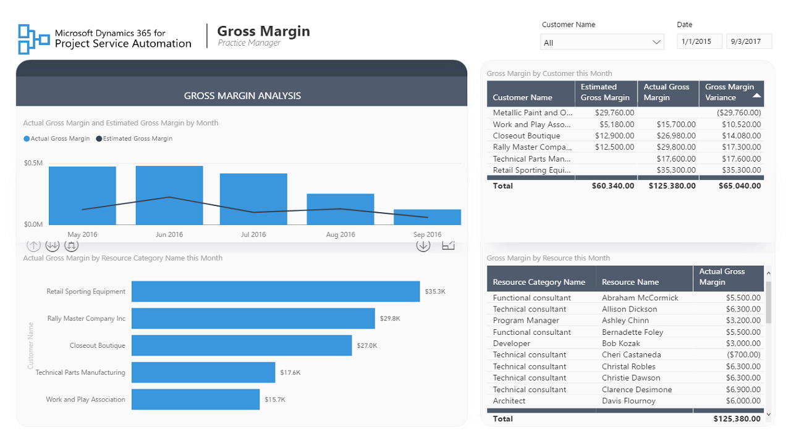

## Cost
Costs by practice by date.
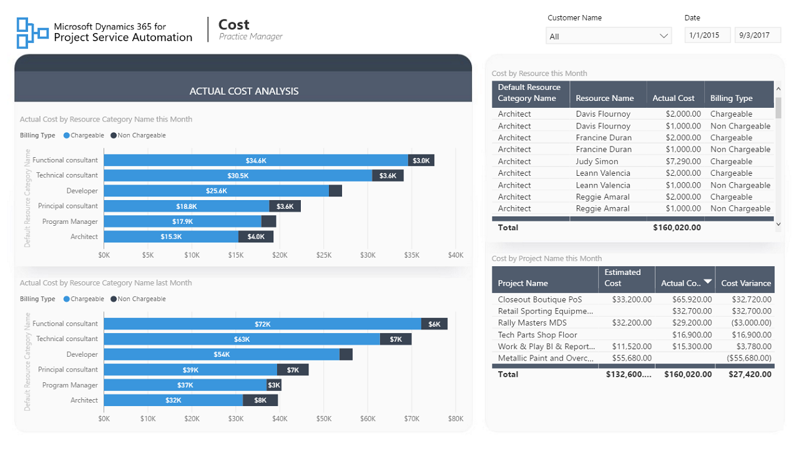

## Cost Estimated vs Actual
Detgais differences betwen estimated an actual cost by practice, customer and date.
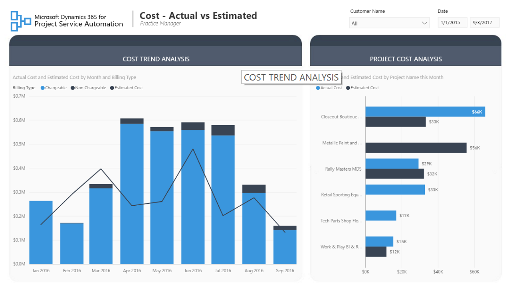

## Customer Revenue
Provides revenue by date and customer.

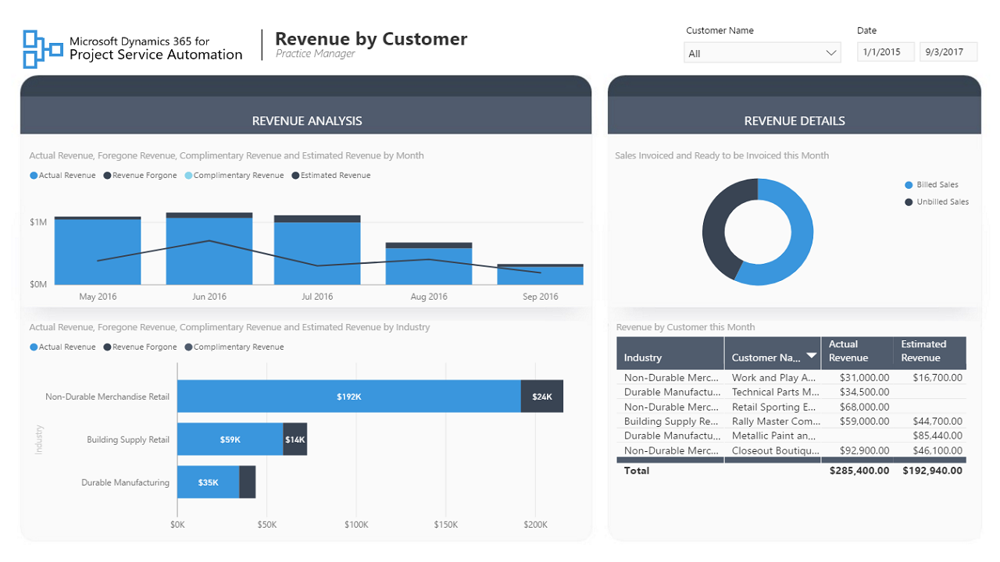

## Resource Revenue
Provides revenue by resource and customer.
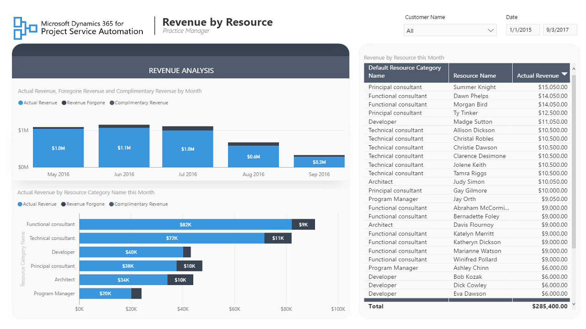

# Technical Description
This section describes each component of the solution template in detail.

## Data Extraction and Load
The Project Service Automation solution template utilizes Scribe replication jobs. The following tables are replicated:
-	account
-	bookableesource
-	bookableesourcebooking
-	bookableesourcecategory
-	bookableresourcecategoryassn
-	bookingstatus
-	msdyn_actual
-	msdyn_estimateline
-	msdyn_orderlineresourcecategory
-   msdyn_organizationalunit
-   msdyn_project
-   msdyn_projecttask
-   msdyn_resourcerequest
-   msdyn_resourcerequirement
-   msdyn_resourcerequirementdetail
-   msdyn_timeentry
-   msdyn_transactioncategory
-   opportunity
-   quote
-   quotedetail
-   salesorder
-   salesorderdetail
-   systemuser

The tables are replicated with custom fields already included.

Additional entities can be replicated to the target database. 

### Date

The Date table is autogenerated with the installation of the solution template from 2013 to 2020.

| Column         | Datatype     | Description |
| ---------------|--------------|--------------|
| date_key      | 	int	      | Numeric datekey in the format yyyymmdd |
| full_date      | 	date	      |  |
| day_of_week      | 	tinyint	      | Day of week – 1 though 7 |
| day_num_in_month      | 	tinyint      | 	Day of month – 1 through 31 |
| day_name      | 	char(9)      | The day name. can be edited to localize |
| day_abbrev      | 	char(3)      | 	Day abbreviation; eg, Mon for Monday |
| weekday_flag      | 	char(1)      | 	y for weekday, n for weekend |
| week_num_in_year      | 	tinyint      | 	Week numer in year ranging from 1 to 52 |
| week_begin_date      | 	date      | 	The date of the beginning of the week for the current date |
| week_begin_date_key      | 	int      | 	The date key of the beginning of the week for the current date |
| month      | 	tinyint      | Month number raning from 1 through 12. |
| month_name      | 	char(9)      | 	Long month name; eg, January |
| month_abbrev      | 	char(3)	      | Short month name; eg, Jan |
| quarter      | 	tinyint	      | Calendar quarter number, from 1 through 4 |
| year	      | smallint       | Year number; eg, 2017 |
| yearmo      | 	int      | Year  and month number; eg, 201703 for March, 2017 |
| last_day_in_month_flag      | 	char(1)      | Set to n if not the last day in the calendar month, set to y for last day in calendar month. |
| same_day_year_ago_date      | 	date      |  |
| same_day_year_ago_key      | 	int	      |  |
| day_num_in_year      | expression      | 	Number of the current day in the calendar year. |
| quarter_name      | 	expression      | 	Name of the current calendar quarter; eg, Q1 |

## Views
The Power BI file is bound to the views. These are defined below:

### State values
All views ending in "_state" are bound to the statemetadata table as follows:
- account_state
- bookableresourcebooking_state
- bookableresourcecategoryassn_state
- bookableresourcecategory_state
- bookableresourcecategory_state
- bookableresource_state
- bookingstatus_state
- msdyn_actual_state
- msdyn_estimateline_state
- msdyn_expensecategory_state
- msdyn_expense_state
- msdyn_orderlineresourcecategory_state
- msdyn_organizationalunit_state
- msdyn_projectteam_state
- msdyn_resourcerequest_state
- msdyn_resourcerequirementdetail_state
- msdyn_resourcerequirement_state
- msdyn_timeentry_state
- msdyn_timeoffcalendar_state
- opportunityclose_state
- opportunity_state
- quoteclose_state
- quote_state
- salesorder_state

| Column         | Datatype           |  Source      | Description  |
| ---------------|--------------------|--------------|--------------|
| [value]  | 	int      |  state      |
| [label]      | 	nvarchar(255)      | 	localizedlabel	|    |

### Code values

Code values are bound to the optionsetmetadata table:
- accountcategorycode_os_account
- accountclassificationcode_os_account
- accountratingcode_os_account
- address1_addresstypecode_os_account
- address1_freighttermscode_os_account
- address1_shippingmethodcode_os_account
- address2_freighttermscode_os_account
- address2_shippingmethodcode_os_account
- bookingtype_os_bookableresourcebooking
- businesstypecode_os_account
- customersizecode_os_account
- customertypecode_os_account
- freighttermscode_os_quote
- freighttermscode_os_salesorder
- industrycode_os_account
- msdyn_allocationmethod_os_msdyn_projectteam
- msdyn_allocationmethod_os_msdyn_resourcerequirement
- msdyn_costperformence_os_msdyn_project
- msdyn_membershipstatus_os_msdyn_projectteam
- msdyn_ordertype_os_opportunity
- msdyn_ordertype_os_quote
- msdyn_ordertype_os_salesorder
- msdyn_overallprojectstatus_os_msdyn_project
- msdyn_relateditemtype_os_msdyn_timeentry
- msdyn_scheduleperformance_os_msdyn_project
- msdyn_type_os_msdyn_resourcerequirement
- opportunityratingcode_os_opportunity
- ownershipcode_os_account
- paymenttermscode_os_account
- paymenttermscode_os_quote
- paymenttermscode_os_salesorder
- preferredappointmentdaycode_os_account
- preferredappointmenttimecode_os_account
- preferredcontactmethodcode_os_account
- prioritycode_os_opportunity
- prioritycode_os_salesorder
- quotestatecode_os_quotedetail
- resourcetype_os_bookableresource
- salesorderstatecode_os_salesorderdetail
- salesstagecode_os_opportunity
- shippingmethodcode_os_account
- territorycode_os_account
- shippingmethodcode_os_salesorder
- shipto_freighttermscode_os_quote
- shipto_freighttermscode_os_quotedetail
- shipto_freighttermscode_os_salesorder
- shipto_freighttermscode_os_salesorderdetail
- status_os_bookingstatus
- timeline_os_opportunity

| Column         | Datatype           |  Source      | Description  |
| ---------------|--------------------|--------------|--------------|
| [value]  | 	int      |  option      |
| [label]      | 	nvarchar(255)      | 	localizedlabel	|    |

### Status values

Status values are bound to the statusmetadata table:
- bookableresourcebooking_status
- bookableresourcecategory_status
- bookableresource_status
- bookingstatus_status
- msdyn_actual_status
- msdyn_estimateline_status
- msdyn_expensecategory_status
- msdyn_expense_status
- msdyn_orderlineresourcecategory_status
- msdyn_organizationalunit_status
- msdyn_projectteam_status
- msdyn_project_status
- msdyn_resourcerequest_status
- msdyn_resourcerequirementdetail_status
- msdyn_resourcerequirement_status
- msdyn_timeentry_status
- msdyn_timeoffcalendar_status
- opportunityclose_status
- opportunity_status
- quoteclose_status
- quote_status
- salesorder_status

| Column         | Datatype           |  Source      | Description  |
| ---------------|--------------------|--------------|--------------|
| [value]  | 	int      |  status    |
| [label]      | 	nvarchar(255)      | 	localizedlabel	|    |

### Global options

Global options are bound to the globaloptionsetmetadata table:
- budgetstatus_gos
- initialcommunication_gos
- msdyn_adjustmentstatus_gos
- msdyn_amountmethod_gos
- msdyn_billingmethod_gos
- msdyn_billingstatus_gos
- msdyn_billingtype_gos
- msdyn_bulkgenerationstatus_gos
- msdyn_committype_gos
- msdyn_competitive_gos
- msdyn_customertype_gos
- msdyn_entrystatus_gos
- msdyn_estimatedbudget_gos
- msdyn_estimatedschedule_gos
- msdyn_expensestatus_gos
- msdyn_expensetype_gos
- msdyn_feasible_gos
- msdyn_profitability_gos
- msdyn_psastate_gos
- msdyn_psastatusreason_gos
- msdyn_receiptrequired_gos
- msdyn_targetentrystatus_gos
- msdyn_targetexpensestatus_gos
- msdyn_transactionclassification_gos
- msdyn_transactiontypecode_gos
- msdyn_type_gos
- msdyn_vendortype_gos
- need_gos
- pricingerrorcode_gos
- producttypecode_gos
- propertyconfigurationstatus_gos
- purchaseprocess_gos
- purchasetimeframe_gos
- salesstage_gos

| Column         | Datatype           |  Source      | Description  |
| ---------------|--------------------|--------------|--------------|
| [value]  | 	int      |  option      |
| [label]      | 	nvarchar(255)      | 	localizedlabel	|    |

### BookingStatusView
This view is populated from the bookingstatus table. It is “flattened” from the recursive source. That is, instead of a recursive parent child relationship, the first three levels are separate columns.

  | Column         | Datatype           |  Source      | Description  |
| ---------------|--------------------|--------------|--------------|
| [Booking Status Id]  | 	int      |  bookingstatusid      |
| [Booking Status Code]     | 	nvarchar(255)      | 	status	|    |
| [Booking Status Name]     | 	nvarchar(255)      | 	bookingstatus.label	|    |
| [Commit Type]     | 	nvarchar(255)      | 	CommitType.label	|    |
| [Commit Type Code]     |  int      | 	msdyn_committype 	|    |

### BusinessTransactionView
This view is a union fo values from msdyn_actual and msdyn_estimateline.

 | Column         | Datatype           |  Source      | Description  |
| ---------------|--------------------|--------------|--------------|
| [Is Estimate] | int | calcuation | 0 for actual, 1 for estimate |
| [Billing Type]  | 	nvarchar(255)      |  BillingType.label      |
| [Billing Status]     | 	nvarchar(255)      | 	BillingStatus.label 	|    |
| [Billing Type Code]     | 	int      | 	msdyn_billingtype	|    |
| [Billing Status Code] | int | msdyn_billingstatus | | 
| [Transaction Category Id] | int | msdyn_transactioncategory| | 
| [Transaction Type Code] | int | msdyn_transactionclassification | |
| [Transaction Class Code] | int | msdyn_transactionclassification | |
| [Transaction Type] | nvarchar(255) | TransactionTypeCode.label | |
| [Transaction Class] |  nvarchar(255) |  TransactionClass.label | |
| [Customer Id]  | UNIQUEIDENTIFIER | msdyn_accountcustomer | |

Note that business units recursing deeper than third level are not included and are included as the third level.

### ConfigurationView
This view is exclusively populated from the psa.Configuration.

| Column         | Datatype           |  Source      | Description  |
| ---------------|--------------------|--------------|--------------|
| Id | int | Id | Values are only included in the view if visible=1 |
| [Configuration Group] | varchar(150) | configuration_group | |
| [Configuration Subgroup] | varchar(150) | configuration_subgroup	| |
| Name | varchar(150) | name | 	|
| Value | varchar(max) | value	 |  |

### ContractView
This view is  populated from dbo.salesorder.

| Column         | Datatype           |  Source      | Description  |
| ---------------|--------------------|--------------|--------------|
| ContractId | int | salesorderid |  |
| Contract Name | nvarchar(max) | Name |  |
| [Contract State Code] | int | msdyn_psastate	| |
| [Contract State] | nvarchar(256) | PSA_State.label | 	|
| [Contract Status Code] | int |  msdyn_psastatusreason | 	|
| [Contract Status] | nvarchar(256) |  PSA_StatusReason.label | 	|
| [Contract Customer Id] | uniqueidentifer| customerid | 	|
| [Contract Total Amount] | decimal(38,10) | totalamount_base | 	|

### CustomerView

| Column         | Datatype           |  Source      | Description  |
| ---------------|--------------------|--------------|--------------|
| [Customer Id] | uniqueidentifier| accountid | |
| [Customer Name] | nvarchar(max) | NAME| |
| sic | nvarchar(max) | sic	| |
| Postal Code | nvarchar(max) | address1_postalcode | |
| Phone | nvarchar(max) |  address1_telephone1	 |  |
| [State/Province] |  nvarchar(max) |  address1_stateorprovince |  |
| Country |  nvarchar(max) | address1_country |  |
| City |  nvarchar(max) | address1_city |  |
| E-Mail |  nvarchar(max) | emailaddress1 | |
| Customer Type |  nvarchar(256) | customertypecode.label |  |
| [Industry Code] | int| industrycode |  |
| Industry | nvarchar(256) | IndustryCode.label	 |  |
 

### DateView
All Dateview columns are exclusively from the Date table.

| Column         | Datatype           |  Source      | Description  |
| ---------------|--------------------|--------------|--------------|
| date_key | char(150) | [full_date]	 |  | 
| [Day of the Week] | tinyint | [day_of_week] | |
| [Day Number of the Month] | tinyint | [day_num_in_month]	 | |
| [Day Name] | char(9) | [day_name] | Long day name; eg, Monday |
| [Day Abbreviated] | char(3) | [day_abbrev] | Short day name; eg, Mon |
| [Weekday Flag] | char(1) | [weekday_flag]	 | |
| month | tinyint | month | integer month from 1 to 12 |
| [Month Name] | char(9) | month_name | Long month name |
| [month_abbrev] | char(3) | [month_abbrev]	 | |
| quarter | tinyint | Quarter | |
| Year | smallint | year |  |
| same_day_year_ago_date | date | same_day_year_ago_date | |
| [Week Begin Date] | date | [week_begin_date] | |

### MeasuresView
This is an empty table that is used as a source for calculated measures in Power BI.

| Column         | Datatype           |  Source      | Description  |
| ---------------|--------------------|--------------|--------------|
| MeasureValues	| int | Calcuated column	| |

### Opportunityview
Values are taken from the opportunity table.

| Column         | Datatype           |  Source      | Description  |
| ---------------|--------------------|--------------|--------------|
| [Opportunity Id]   | uniqueidentifer | opportunityid    | |
| [Opportunity Name] | nvarchar(max) |        NAME        | |
| [Opportunity Description]       | nvarchar(max)  |          [description] | |                 
| [Opportunity Type Code]         | int |      msdyn_ordertype  | |
| [Opportunity Type] | nvarchar(256) |          OrderType.label | |
| [Sales Stage Code] | int |          salesstage        |     |                   
| [Sales Stage]      | nvarchar(256) |          SalesStage.label     | | 
| [Opportunity Actual Close Date] | date |  CONVERT(DATE as actualclosedate)      |  |
| [Opportunity Actual Revenue]    | decimal(38,10) | actualvalue_base        |  |
| [Step Name]        | nvarchar(max)  |       stepname                         |    | 
| [Opportunity Status Code]       | int |       statuscode                   |  |
| [Opportunity Status]            | nvarchar(256) | ent_status.label     |     | 
| [Opportunity Rating Code]       | int |        opportunityratingcode      |   |
| [Opportunity Rating]            | nvarchar(256) | OpportunityRating.label  | |
| [Opportunity Close Probability] | numeric(13,2) | closeprobability * 0.01   | |
| [Opportunity Estimated Revenue] | decimal(38,10) | estimatedvalue_base      |  |
| [Opportunity Created On Date]   | date |      CONVERT(DATE as opportunity.createdon)| |
| [Opportunity Estimated Close Date]  | date  |  CONVERT(DATE as estimatedclosedate) | |
| [Customer Id]      | uniqueidentifer |         customerid          |  |
| [Customer Need]    | nvarchar(max) |        customerneed          | |               
| [Opportunity Final Decision Date] |date | CONVERT(DATE as finaldecisiondate)    | |
| [Opportunity Purchase Time Frame Code] | int | purchasetimeframe                  |  | 
| [Opportunity Purchase Time Frame] | nvarchar(256) | PurchaseTimeframe.label | |
| [Opportunity Total Amount]        | decimal(38,10)  |    totalamount_base  |         |  
| [Opportunity State Code]          | int  | statecode                      |      | 
| [Opportunity State]               | nvarchar(256)  | ent_state.label        |    | 
| [Customer Pain Points]            | nvarchar(max)  |  customerpainpoints  |  |
| [Opportunity Account Manager Id]  | uniqueidentifier |  msdyn_accountmanagerid |  |
| [Opportunity Account Manager]     | nvarchar(max)   | systemuser.fullname   |  |
| [Opportunity Timeline Code]       | int | timeline                        |     |
| [Opportunity Timeline]            | nvarchar(256)  | Timeline.label  |  |

### ProjectView
Values are sourced from the msdyn_project table.

| Column         | Datatype           |  Source      | Description  |
| ---------------|--------------------|--------------|--------------|
|[Project Id] | uniqueidentifer | msdyn_projectid   | |
|[Project Customer Id] |uniqueidentifer |        msdyn_customer| |                      
|[Project Name] | nvarchar(max) |        msdyn_subject | |                      
 |[Project Description] | nvarchar(max) | msdyn_description| |
 |[Project Manager User Id] |uniqueidentifer | msdyn_projectmanager | |                
|[Project Manager Name] | nvarchar(max) |        systemuser.fullname | |
|[Project Actual Start] | date |        CONVERT(DATE as msdyn_actualstart) | |   
 |[Project Actual End] | date |       CONVERT(DATE as msdyn_actualend)    | |  
|[Project Scheduled Start] |date  |        CONVERT(DATE as msdyn_scheduledstart) | | 
|[Project Scheduled End] | date |        CONVERT(DATE as msdyn_scheduledend)   | |
|[Project Cost Performance] | nvarchar(256) |        CostPerformance.label | |              
|[Project Cost Performance Code] | int |        msdyn_costperformence | |             
|[Project Schedule Performance] |  nvarchar(256) | SchedulePerformance.label| |
|[Project Schedule Performance Code] | int | msdyn_scheduleperformance| |
|[Project Stage Name] |  nvarchar(256) | msdyn_stagename| |
|[Project Contracting Unit Id]  | uniqueidentifer|       msdyn_contractorganizationalunitid  | |

### ProjectContractView
Values are sourced from the msdyn_project and salesorderdetail.

| Column         | Datatype           |  Source      | Description  |
| ---------------|--------------------|--------------|--------------|
| [contract id] | uniqueidentifier | [contract id] | |
| [Project ID] | uniqueidentifier | msdyn_project | |

### QuoteView

Values are sourced from the quote table.

| Column         | Datatype           |  Source      | Description  |
| ---------------|--------------------|--------------|--------------|
| [Quote Id] | uniqueidentifier | quoteid  | |                                      
|[Quote Description]| nvarchar(max) |       description  | |                                 
  |[Quote Number]| nvarchar(max)  |        quotenumber   | |                               
 |[Quote Name]| nvarchar(max)  |        NAME        | |                                  
 |[Quote Type Code]| int |        msdyn_ordertype   | |                            
|[Quote Type]| nvarchar(256)  |        OrderType.label      | |                          
  |[Customer Id]| uniqueidentifier |        customerid    | |                               
 |[Quote Budget Estimation]| nvarchar(256) |       EstimatedBudget.label   | |                       
|[Quote Budget Estimation Code]| int |      msdyn_estimatedbudget   | |                       
|[Quote Schedule Estimation]|  nvarchar(256) |        EstimatedSchedule.label  | |                      
 |[Quote Schedule Estimation Code]| int |       msdyn_estimatedschedule   | |                    
|[Quote Feasibility]|  nvarchar(256) |        Feasible.label  | |                               
|[Quote Feasibility Code]| int |        msdyn_feasible               | |                  
|[Quote Profitability]|  nvarchar(256) |        Profitability.label  | |                         
|[Quote Profitability Code]| int |      msdyn_profitability  | |                          
|[Quote Competitivness] | nvarchar(256) |        Competitive.label     | |                         
  |[Quote Competitivness Code]| int |       msdyn_competitive    | |                         
|[Quote Gross Margin (%)] | numeric(38,9) |        msdyn_grossmargin * 0.01 | |                     
|[Quote Adjusted Gross Margin (%)]|  numeric(38,9) |        msdyn_adjustedgrossmargin * 0.01     | |          
|[Quote Customer Budget]|  numeric(38,10)|        msdyn_customerbudgetrollup_base    | |            
|[Quote Total Amount]| numeric(38,10) |        totalamount_base                   | |            
|[Quote Total Chargeable Cost]|   numeric(38,10)|        msdyn_totalchargeablecostrollup_base| |           
|[Quote Total Non-Chargeable Cost]|  numeric(38,10)|        msdyn_totalnonchargeablecostrollup_base   | |     
|[Quote Account Manager User Id]| uniqueidentifier|        msdyn_accountmanagerid   | |                      
|[Quote Account Manager]| nvarchar(max)|       systemuser.fullname              | |              
 |[Quote Created On Date]| date |        CONVERT(DATE as quote.createdon)   | |             
|[Quote Effective To Date]| date  |       CONVERT(DATE as effectiveto) | |                    
|[Quote Estimated Completion Date]| date |       CONVERT(DATE as msdyn_estimatedcompletionrollup) | | 
|[Quote Effective From Date]| date |        CONVERT(DATE as effectivefrom)   | |                
|[Quote Closed On Date] | date |        | if no quote close date then we assume it is the date when quote state was changed to Won or Closed |                      
|[Quote Requested Delivery Date]| date |       CONVERT(DATE as requestdeliveryby)   | |             
|[Opportunity Id]|  uniqueidentifier|        opportunityid    | |                              
 |[Quote State Code]| int |        statecode  | |                                   
  |[Quote State]| nvarchar(256)|       StateCode.label     | |                          
|[Quote Discount Amount]| numeric(38,10) |       discountamount_base     | |                       
 |[Quote Discount (%)]| numeric(38,9) |        discountpercentage * 0.01   | |                  
|[Quote Total Discount Amount]|numeric(38,10) |        totaldiscountamount_base      | |                 
|[Quote Total Line Item Discount Amount]|numeric(38,10) |        totallineitemdiscountamount_base       | |        
|[Quote Total Line Item Amount]    | numeric(38,10)numeric(38,9)|     totallineitemamount_base      | |                 

### QuoteLineView

Values are sourced from the quotedetail table.

| Column         | Datatype           |  Source      | Description  |
| ---------------|--------------------|--------------|--------------|
 |   [Quote Id]| uniqueidentifier |quoteid      |  |            
 |   [Quote Product Type Code]|  int |        producttypecode |  |         
|   [Quote Product Type]| nvarchar(256) |        ProductTypeCode.label   |  | 
|   [Quote Line Extended Amount]|  decimal(38,10)|        extendedamount_base |  |
 |   [Quote Line Base Amount]|  decimal(38,10) |        baseamount_base    |  |       
|   [Quote Line Manual Discount Amount]| decimal(38,10) |        manualdiscountamount_base |  | 
|   [Quote Line Volume Discount Amount]| decimal(38,10) |        volumediscountamount_base |  | 

# Project Service Automation for Dynamics 365 Pricing

For a detailed breakdown of Azure Key Vault costs you can refer to the [Key Vault Pricing Calculator](https://azure.microsoft.com/en-us/pricing/details/key-vault/)

For a detailed breakdown of Azure SQL costs you can refer to the [SQL Database Pricing Calculator](https://azure.microsoft.com/en-us/pricing/details/sql-database)

For a detailed breakdown of Azure Analysis Services costs you can refer to the [SQL Database Pricing Calculator](https://azure.microsoft.com/en-us/pricing/details/sql-database)