Social Analytics for Lithium Solution Template by iTalent Digital Documentation
===========================================================

# [Table of Contents](#table-of-contents)
1. [Introduction](#introduction)
2. [Architecture](#architecture)
3. [System Requirements](#system-requirements)
4. [How to Install](#how-to-install)
5. [Architecture Deep Dive](#architecture-deep-dive)
6. [Data Model Schema](#data-model-schema)
7. [Reports](#reports)
8. [Extension and Customizations](#extension-and-customizations)
9. [Estimated Costs](#estimated-costs)


### Introduction

The Social Analytics for Lithium solution template provides valuable community learnings. The template stands up an end-to-end solution that pulls the data from Lithium API's while enriching the data for analytics in Azure SQL. It allows users to create customized reports or utilize pre-built Power BI reports to analyze the data and discover extensive insights. This solution template is useful for those interested in Lithium community users, boards, categories, topics and replies.

iTalent Digital’s “Social Analytics for Lithium” solution provides important community insights by looking at metrics like total registered users, boards, topics, messages, solutions and kudos. The Power BI reports illustrate community growth in terms of the number of users, messages and solution overtime, while also providing an analysis board, as well as category-level issues and product solutions.

This powerful solution template makes it possible to:

-   Get started quickly with pre-built data models for reporting advanced community and social analytics.
-   Use an intuitive, wizard-based UI to deploy, data integration and Power BI reports.
-   Get insights about community users visitor growth and contributions to the community.
-   Go back in history to execute a trend analysis and evaluate community growth.

The following document provides a walkthrough of the architecture, a deep dive into each component, comments on customization options, as well as information on additional topics like pricing. For any questions not covered in this document, please contact the team at <pbisa@italentdigital.com>

### Architecture


The flow of the Social Analytics for Lithium solution template is as follows:

-   Azure Function pulls the data from the Lithium V2 API's.

-   Azure Function pushes the data to Azure SQL.

-	Azure SQL cleans, transforms and enriches the data for analytics.

-   Power BI imports data into it from Azure SQL and renders pre-defined reports.


### System Requirements

Setting up the template requires the following:

-   A Lithium Community User Account

-   Access to an Azure subscription

-   Power BI Desktop (*latest version*)

-   Power BI Pro (*to share the template with others*)

<p><strong><a href="#table-of-contents">Back to Top</a></strong></p>


### How to Install

To get started with the solution, navigate to the [Social Analytics for Lithium template page]( https://powerbi.microsoft.com/en-us/solution-templates/) and click **Install Now**.

**Getting Started:** This page introduces the template and explains the architecture.

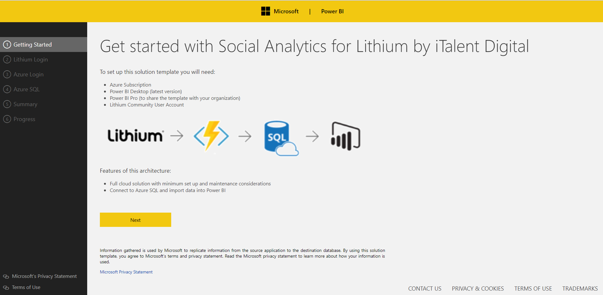

**Lithium Login:** Use OAuth to sign into your community account. You will need to provide your community app TenantID, ClientID, Client Secret and Refresh Access Token (we will not make any changes to your Lithium community account).

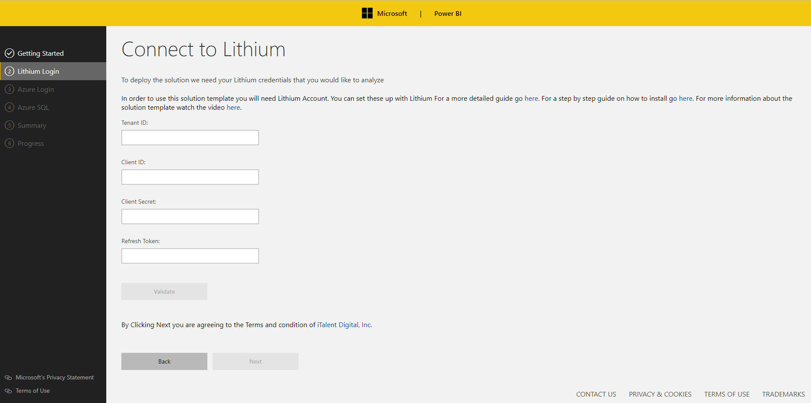

To locate your TenantID, ClientID, or Client Secret details, access your Community admin settings by signing into your community and navigating to Community Admin > SYSTEM > API Apps.

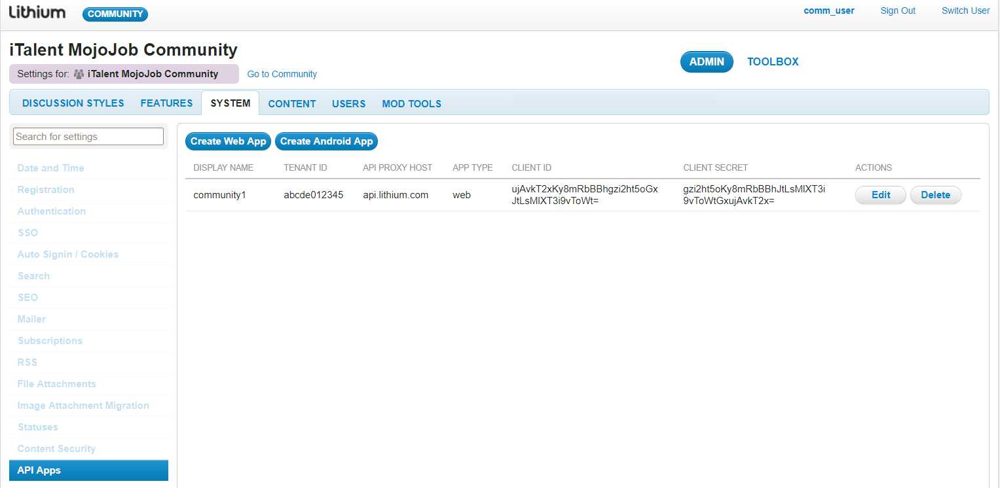

**Refresh Token: A** refresh token is required to refresh the access tokens along with other credentials. Access tokens allow the community members to make REST API calls to Lithium. You may already have a refresh token to generate an *access token* for your community to make API calls. If so, utilize that refresh token. If you do not have the refresh token please follow the steps provided [here](https://community.lithium.com/t5/Developer-Documentation/bd-p/dev-doc-portal?section=oauth2#requestAccessRefresh) to generate your *refresh token*.

**Azure:** Use OAuth to sign into your Azure account. You will notice you have a choice between signing into an organizational account and a Microsoft (work or school account).

If you select a Microsoft account, you will need to provide the application with a domain directory. You can find your domain by logging into your Azure account, clicking on your email in the top right-hand corner and choosing from the options listed below:

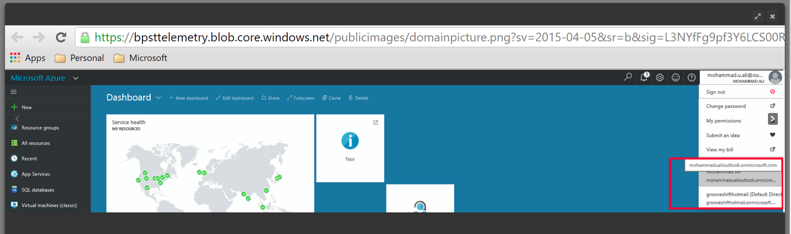
If you belong to a single domain, simply hover over your e-mail address in the same place:

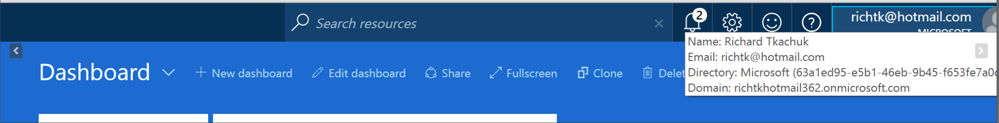

In this example, the domain is: richtkhotmail.362.onmicrosoft.com.

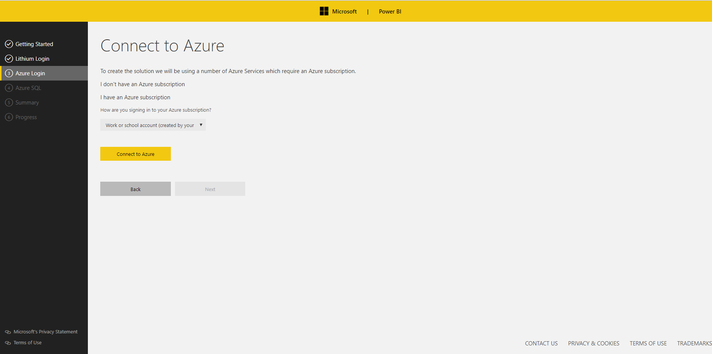

Logging into Azure gives the application access to your Azure subscription and permits spinning up Azure services on your behalf. If you prefer a more granular breakdown of the costs, please scroll down to the Estimated Costs section.

As you navigate away from this page, a new resource group is spun up on your Azure subscription (the name is random but always prefixed by ‘SolutionTemplate-‘). To change the name, go to the Advanced Settings tab. All newly created resources will go into this container.

**Azure SQL:** You have the option of connecting to an existing SQL Server or providing details which the application will use to spin up an Azure SQL on your behalf. This template only supports Azure SQL. If you choose to spin up a new Azure SQL, this will get deployed in your Azure subscription, inside the newly created resource group.

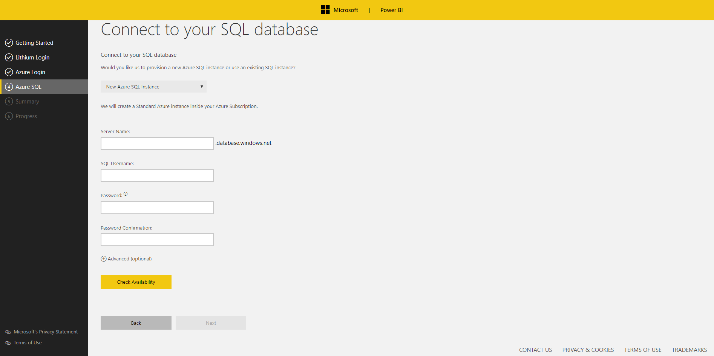

**Summary:** This page outlines all the choices made by the user.

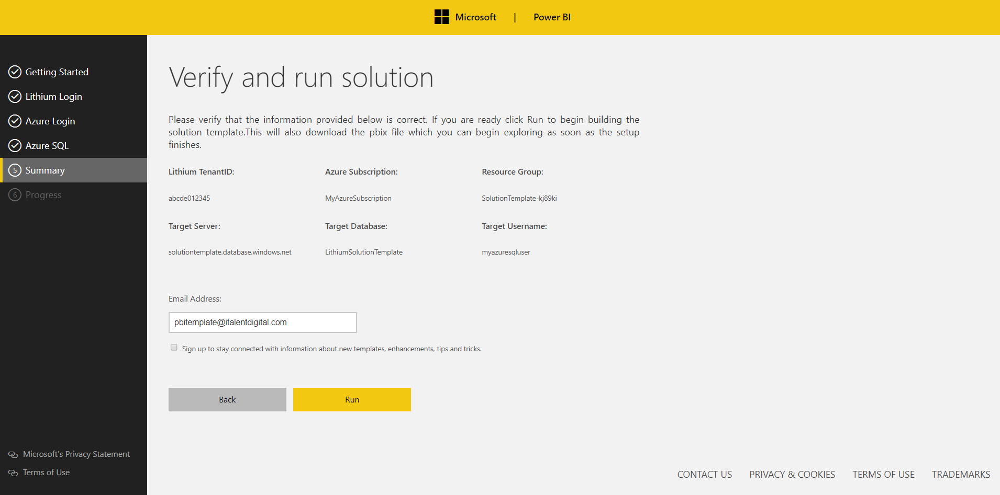

**Deploy:** When you navigate to the deployment page, the setup process is kicked off. SQL scripts run to create the necessary tables and views (with Azure SQL Server and database, if new server option selected). An Azure Function is then spun up on your Azure subscription.

**It is important that you do not navigate away from this page while deployment takes place.** Once everything is deployed a download link will appear for a Power BI file which consists of  the pre-defined reports.

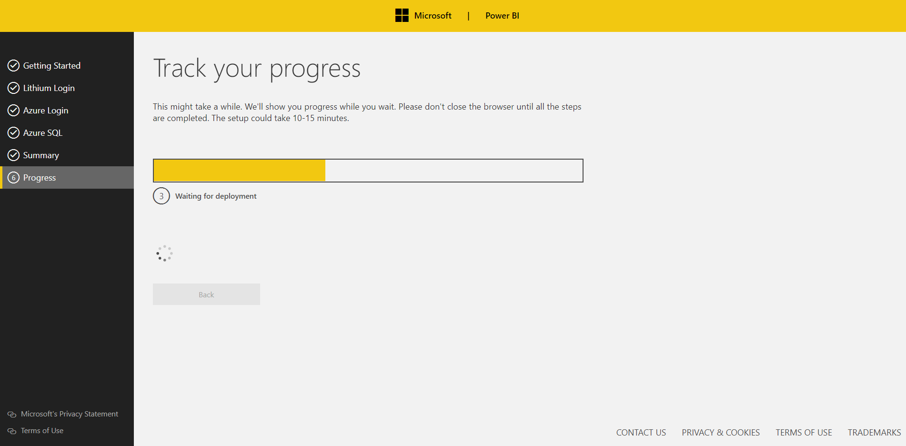

**Power BI Report:** Once you download the Power BI desktop file you will need to connect it to your data. To do so, simply open the pbix and follow the instructions on the front page.

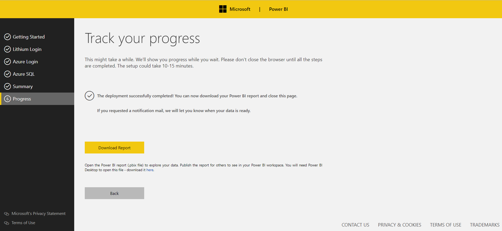


<p><strong><a href="#table-of-contents">Back to Top</a></strong></p>


### Architecture Deep Dive

The following section will explain how the template works by going through all the components of the solution.


**Azure Resources:**
You can access the resources that have been spun up by logging into the Azure portal. Everything should be under one resource group unless a user is using an existing SQL server. In that case, the SQL Server will appear in the resource group it already existed in.

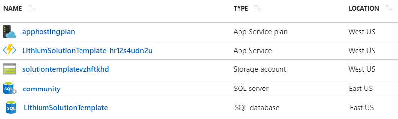


Here is an example of what gets spun up for a user. We will go through each of these items one by one:

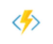

**Azure Function:**

Azure functions are serverless compute services that enable you to run code on-demand, without having to explicitly provision, or manage infrastructure. These functions will run a script or piece of code in response to a variety of events.

A time-trigger azure function is created during the solution template deployment and is scheduled to run every day at 6:00 AM (this can be changed from function schedule settings ) in a newly created Azure resources in your Azure subscription.

The Run method in the "LithiumETL" Azure function calls the LoadandProcessLithiumData method with Lithium credentials and Azure SQL connection string in iTalent.LithiumConnector.GetLithiumData class.


```C#
public static void Run(TimerInfo myTimer, TraceWriter log)
{
    string strTenantID = ConfigurationManager.AppSettings["LithiumTenantId"].ToString();
    string strClientID = ConfigurationManager.AppSettings["LithiumClientId"].ToString();
    string strClientSecret = ConfigurationManager.AppSettings["LithiumClientSecret"].ToString();
    string strRefreshToken = ConfigurationManager.AppSettings["LithiumRefreshToken"].ToString();
    string strSQLConn = ConfigurationManager.AppSettings["SqlConnectionString"].ToString();

    if (strSQLConn != string.Empty && strTenantID != string.Empty && strClientID != string.Empty && strClientSecret != string.Empty && strRefreshToken != string.Empty)
    {
        log.Info($"Starting the Lithium ETL execution at: {DateTime.Now.ToString()}");

        new GetLithiumData(log).LoadandProcessLithiumData(strSQLConn, strTenantID, strClientID, strClientSecret, strRefreshToken);

        log.Info($"Completed the Lithium ETL execution at: {DateTime.Now} .");
    }
}
```

The iTalent.LithiumConnector API contains all the methods required to pull the data from Lithium V2 API's, using the credential provided, and pushes the data into Azure SQL passed to the method.

The API pulls all users, user badges, boards, categories, the last 30 days of messages and kudos from Lithium community in JSON format and pushes the data into Azure SQL staging tables. It also pulls the community name and inserts into it.Parameters table in the database. Subsequent runs will pull only last one day  of messages. along with all other feed data.

```Messages sample JSON
{
	"type": "message",
	"id": "300022",
	"subject": "Lithium Solution template",
	"board": "KnowledgeBase",
	"topic": "Lithium Solution template",
	"post_time": "2017-02-10T02:00:00.000-07:00",
	"is_solution": false,
	"metrics": {
	"type": "message_metrics",
	"views": 1000
	}
},
{
    "type": "message",
    "id": "300023",
    "subject": "Create a new community",
    "board": "KnowledgeBase",
    "topic": "Create a new community",
    "post_time": "2017-02-10T02:00:01.088-07:00",
    "is_solution": false,
    "metrics": {
    "type": "message_metrics",
    "views": 2100
	}
},
```

After all the Lithium data pushes to the Azure SQL staging table, the API calls the it.SyncData stored procedure in the database to merge all the data into actual reporting tables.  To learn more about the schema, please go to the Data Model Schema section.


<p><strong><a href="#table-of-contents">Back to Top</a></strong></p>


### Data Model Schema

Here is an overview of the tables found in the model:

|**Table Name**        |   **Description**|
|----------------------|-----------------------------------------------------------------------------------------|
| Badges               | Badges are a type of visual reward that community members earn for completing specific community actions or for achieving crucial community milestones. |
| Boards               | Boards are the parent of a conversation (a thread of topic messages and replies). Boards can be contained in categories to provide a structure for your community, although a board can also live outside of a category.|
| Categories           | Categories are the highest-level nodes in your community. Depending on the business purpose for your community, your categories might reflect lines of business, product lines, or other high-level divisions.|
| Kudos                | Kudos are a way for users to approve content they like. A kudo boosts the value of a post and improves the reputation of its author.|
| Messages             | Messages consist of a post made to the community using one of the Lithium conversation styles. They can represent any: <ul><li>Forum post (a topic or reply)</li><li>Knowledge base article or a comment about the article</li><li>Question or answer posted to a Q&A board, or associated comment</li><li>Blog article or a comment on the article</li><li>Idea submitted to an Idea Exchange, or comment on an idea</li><li>Contest entry or comment on an entry</li><li>Topic posted to a group discussion board or associated reply</li><li>Product review or associated comment</li></ul>|
| UserBadges           | UserBadges are badges earned by the user.|
| Users                | Users are registered community users. Users exist within a single community and do not cross over between communities.|


Below is a breakdown of the columns found in every table:

|**Badges**                |                                                        |
|--------------------------|--------------------------------------------------------|
| **Column Name**          | **Description**                                        |
| BadgeId                  | Unique value for the badge table.                      |
| BadgeTitle	           | Name of the badge.                                     |
| BadgeIconUrl	           | URL of the badge icon image uploaded in the Community. |
| ModifiedBy	           | User name who runs the solution template (system user).|
| ModifiedDate	           | Data row updated/inserted date.                        |


|**Boards**                |                                                                                       |
|--------------------------|---------------------------------------------------------------------------------------|
| **Column Name**          | **Description**                                                                       |
| BoardID                  | The unique ID of the resource as defined in Community Admin.                          |
| BoardTitle               | The title of the board as defined in Community Admin.                                 |
| ConversationStyle        | The conversation style of the board. Possible values: <ul><li>Blog - a blog</li><li>Contest - a contest board</li><li>Forum - a forum board (discussions)</li><li>Idea - an idea exchange board</li><li>Q&A - a quesion and answer board</li><li>KB - a knowledge base</li></ul>|
| ParentCategoryID         | The parent category of this board, i.e., the category in which the board appears in the community structure. The value is null if the board is located directly under the community (not within any category). This field must be explicitly set to null when creating/updating a board to signify that the board belongs at the community (root) level.|
| IsHidden                 | Whether this board is hidden from view in the community UI. You can hide boards can be hidden from lists and menus by selecting Edit Properties in Community Admin > Community Structure. |
| BoardMessages            | Messages count in the board (topics and comments/replies).                            |
| BoardTopics              | Topic messages count (i.e. the root messages) within a board.                         |
| BoardViews               | The number of views for the board.                                                    |
| BoardDepth               | The depth of the board in the community structure.                                    |
| ModifiedBy               | User name of the individual who runs the solution template (system user).             |
| ModifiedDate             | Data row updated/inserted date.                                                       |


|**Categories**            |                                                                       |
|--------------------------|-----------------------------------------------------------------------|
| **Column Name**          | **Description**                                                       |
| CategoryID               | The unique ID of the category as defined in Community Admin.          |
| CategoryTitle            | The title of the category as defined in Community Admin.              |
| IsHidden                 | Whether the category is hidden from view in the UI. Categories can be hidden from lists and menus by selecting Edit Properties in Community Admin > Community Structure. |
| CategoryMessages         | Messages count in the category (aggregate messages count in all boards within that category). |
| CategoryTopics           | Topic messages count in the category (aggregate topic messages count in all boards within that category). |
| CategoryViews            | The number of views for the category.                                 |
| CategoryDepth            | The depth of the category in the community structure.                 |
| ModifiedBy	           | User name of the individual who runs the solution template (system user). |
| ModifiedDate             | Data row updated/inserted date.                                       |


|**Kudos**					|																		|
|---------------------------|-----------------------------------------------------------------------|
| **Column Name**			| **Description**														|
| KudoID					| The unique ID of the kudo.											|
| MessageID					| The MessageID that the kudo was given to.								|
| KudoDate					| The date the kudo was given.											|
| KudoUserID				| The UserID who gave the kudo.											|
| KudoWeight				| The weight of this kudo.												|
| ModifiedBy				| User name of the individual who runs the solution template (system user). |
| ModifiedDate				| Data row updated/inserted date.										|


|**Messages**					|																	|
|---------------------------|-----------------------------------------------------------------------|
| **Column Name**			| **Description**														|
| MessageKey				| Auto Incremented field.												|
| MessageID					| The unique ID of the message. |
| UserID					| The UserID of the individual who posted the message. |
| MessageSubject			| The subject of the message. |
| BoardID					| The BoardID in which the message appears. A board can be any: forum, KB, Q&A, blog, idea, contest, group, or review. The conversation style derives from the original board type that contains the message. |
| Topic						| The root message of the conversation in which the message appears. Filtering by topic.id returns all replies to a message in a flattened (unthreaded) view. Alternatively see parent. |
| ParentMessageID			| The parent of the message. Filtering by parent.id returns only direct replies or comments to the specified message. (This can be used to replicate a threaded view of messages.) Alternatively, see topic. |
| PostedDate				| The date and time that the message was posted to the community.  |
| MessageDepth				| How many levels away from the topic message the message appears in the conversation thread. Zero (0) indicates that the message is topic message; one (1) indicates a reply; two (2) indicates a reply to a reply, and so on. |
| IsSolution				| Used with forum and Q&A boards. This determines whether the message has been marked as an Accepted Solution. |
| SolutionDate				| Included in the response when IsSolution is true. Includes additional information about the solution. Returns empty if IsSolution is false. |
| MessageViews				| The number of views for the Message. |
| MessageKudos				| The query to retrieve kudos given count to the message. |
| DeviceType				| The kind of device being used to view the message. |
| ModifiedBy				| User name of the individual who runs the solution template (system user). |
| ModifiedDate				| Data row updated/inserted date. |


|**UserBadges**					|																	|
|---------------------------|-----------------------------------------------------------------------|
| **Column Name**			| **Description**														|
| UserID					| The UserID of the individual who received the badge.					|
| BadgeId					| Unique badge ID (from Badges table) earned by the user.				|
| BadgeActivationDate		| Date from when the badge is active.									|
| BadgeEarnedDate			| Date user has earned the badge.										|
| ModifiedBy				| User name of the individual who runs the solution template (system user).	|
| ModifiedDate				| Data row updated/inserted date.										|


|**Users**					|																		|
|---------------------------|-----------------------------------------------------------------------|
| **Column Name**			| **Description**														|
| UserId					| The unique ID of the user.											|
| UserName					| The login name of the user.											|
| Deleted 					| Whether the user's account is deleted (closed account). True, if deleted. |
| RegistrationDate			| Date the user registered with the community.							|
| LastVisited				| Date/time the user was last active on the community.					|
| Banned					| Whether or not the user is banned. True if banned.					|
| ModifiedBy				| User name of the individual who runs the solution template (system user).	|
| ModifiedDate				| Data row updated/inserted date.										|

<p><strong><a href="#table-of-contents">Back to Top</a></strong></p>

### Reports
The following section walks through each report page outlining the intent of the page.

**Community**

The community page will give community level details like total users, new registration (in the last 28 days), total boards and categories in the community. The visuals are explained below:
<ul>
<li><b>Total members:</b> Cumulative sum of number of registrations till date.</li>
<li><b>New members:</b> Counts the number of completed registrations.</li>
<li><b>Retention (Engagers):</b> Percent (%) of members who have logged in at least once in the last 31 days, and have engaged (posted content) in the community.</li>
<li><b>Retention (Viewers):</b> Percent (%) of members who have logged in at least once in the last 31 days, and have viewed content in the community.</li>
<li><b>Boards:</b> Total number of boards in the community.</li>
<li><b>Categories:</b> Total number of categories in the community.</li>
<li><b>Registrations by date:</b> Bar graph representing the number of registrations.</li>
<li><b>Message views by device type:</b> Pie chart representing the total count of message views by device type (e.g., Desktop, Mobile, Tablet).</li>
<li><b>Top 10 users by messages:</b> Bar graph representing the top 10 users who posted content (count of topics and replies in descending order) in the community.</li>
<li><b>Post by Categories:</b> Stacked area chart representing the count of topics and replies posted in the respective categories by users.</li>
</ul>

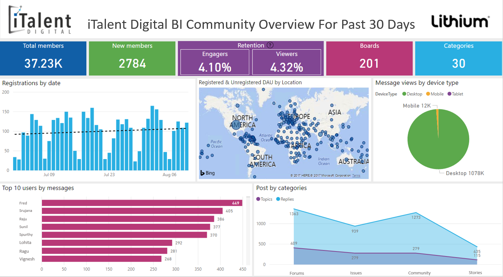


**Content**

The content page will provide thes total number of topics, replies, solutions and kudos for last 30 day's worth of data.
<ul>
<li><b>Topics:</b> Number of conversations initiated by users.</li>
<li><b>Replies:</b> Number of replies posted by users.</li>
<li><b>Solutions:</b> Number of authored solutions.</li>
<li><b>Kudos:</b> Count of kudos given to posts in the community.</li>
<li><b>Messages by date:</b> Line chart representing the number of topics and replies in the community by date.</li>
<li><b>Replies by topic:</b> Stacked area chart representing the number of replies to each topic.</li>
<li><b>Top 10 boards by message views:</b> Funnel graph representing the top 10 boards in the descending order of page views.</li>
<li><b>Solution views by category:</b> Stacked area chart representing the number of solution views by category.</li>
<li><b>Solutions by topic:</b> Tree map representing the number of solutions for each topic.</li>
</ul>

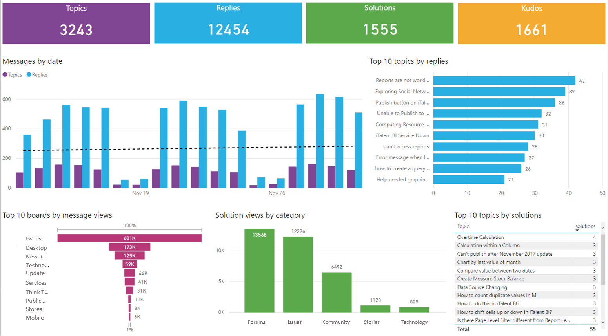


**Users**
The user page give insights about user activities and their contributions to the community.
<ul>
<li><b>Community activity by user:</b> Stacked bar graph representing the number of topics, replies, kudos received, solutions authored by user.</li>
<li><b>Badges earned:</b> Tabular view of badges earned by users in the last 31 days.</li>
<li><b>Topics:</b> Bar graph representing the top 10 users in the descending order of count of topics created.</li>
<li><b>Replies:</b> Bar graph representing the top 10 users in the descending order of count of replies posted.</li>
<li><b>Solutions:</b> Bar graph representing the top 10 users in the descending order of count of solutions authored.</li>
<li><b>Kudos:</b> Bar graph representing the top 10 users in the descending order of count of kudos received.</li>
</ul>

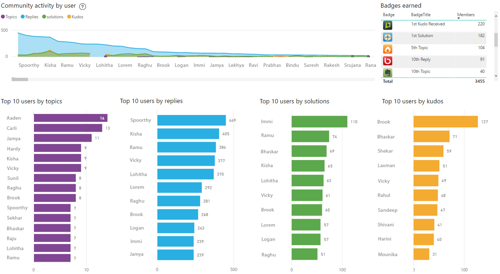


### Extension and Customizations

The Social Analytics for Lithium solution is free to try and use as-is. To customize this template for your specific needs, please reach out to us at pbisa@italentdigital.com and, we will help extend the solution.

<p><strong><a href="#table-of-contents">Back to Top</a></strong></p>

### Estimated Costs

The cost of the Social Analytics for Lithium solution template is the total of the costs associated with the Azure resources used therein. The two Azure resources utilized are:

<ul>
<li>Azure Functions</li>
<li>Azure SQL Database</li>
</ul>

**Azure Resources						Monthly Cost**
Azure Functions (Standard Tier)		$75.00
Azure SQL Database (Standard 1)		$30.00


The Lithium connector cost is not included in this document. Its available [here](https://www.lithium.com/company/pricing/price-quote).

Detailed Azure functions costs can be found here [here](https://azure.microsoft.com/en-us/pricing/details/functions/).

Detailed Azure SQL Database service costs are found [here](https://azure.microsoft.com/en-us/pricing/details/sql-database/). The default Azure SQL Database service tier is S1 but can be modified during or after provisioning. If available, an existing Azure SQL Server and Database can be used. 

Power BI costs are not included in this document. The Power BI cost estimator is available [here](https://powerbi.microsoft.com/en-us/pricing/).

<p><strong><a href="#table-of-contents">Back to Top</a></strong></p>