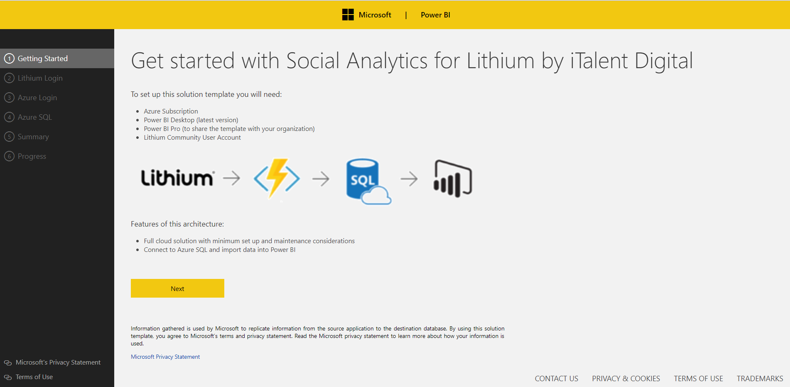

Social Analytics for Lithium Solution Template by iTalent Digital Documentation
===========================================================

# Table of Contents
1. [Introduction](#introduction)
2. [Architecture](#architecture)
3. [System Requirements](#system-requirements)
4. [How to Install](#how-to-install)
5. [Architecture Deep Dive](#architecture-deep-dive)
6. [Model Schema](#model-schema)
7. [Reports Walkthrough](#report-walkthrough)
8. [Estimated Costs](#estimated-costs)

### Introduction

The Social Analytics for Lithium solution template provides analytics about your community, the template stands up an end-to-end solution that pulls the data from Lithium API's, enriches the data for analytics in Azure SQL. Users can then use pre-built Power BI reports to analyze the data and finding insights.
The template is aimed at anyone who is interesting in Lithium community users, boards, categories, topics and replies.

The “Social Analytics for Lithium” by iTalent Digital solution template lets you gain insights about your community by looking at important metrics like total registered users, boards, topics, messages, solutions and kudos. The Power BI Reports provide the community growth in terms of number of users, messages and solution overtime, and analyse board and category level issues and solutions of the product.

The template lets you do things like:

-	Get started quickly with pre-built data models for and advanced community and social analytics reporting.

-	Use an intuitive wizard based UI to deploy, data integration and Power BI Reports.

-	Get insights about your community users and visitors growth and contribution to the community.

-	Go back in history to do trend analysis to see your community growth.

The following document provides a walkthrough of the architecture, a deep dive into every component, comments on customizability as well as information on additional topics like pricing. For any questions not covered in this document, please contact the team at <pbitemplate@italentdigital.com>

### Architecture

The flow of the Social Analytics for Lithium solution template is as follows:

-   Azure Function pulls the data from the Lithium V2 API's

-   Azure Function pushes the data to Azure SQL

-	Azure SQL cleans, transforms and enriches the data for analytics

-   Power BI imports data into it from Azure SQL and renders pre-defined reports

### System Requirements

Setting up the template requires the following:

-   Lithium Community User Account

-   Access to an Azure subscription

-   Power BI Desktop (latest version)

-   Power BI Pro (to share the template with others)

### How to Install

To get started with the solution, navigate to the [Social Analytics for Lithium template page]( https://powerbi.microsoft.com/en-us/solution-templates/) and click **Install Now**.

**Getting Started:** Starting page introducing the template and explaining the architecture.

**Lithium Login:** Use OAuth to sign into your community account. You will need to provide your community app TenantID, ClientID, Client Secret and Authorization Redirect URL. You can find these details in your community admin settings. To get these details sign into your community and navigate to "Community Admin".

**Azure:** Use OAuth to sign into your Azure account. You will notice you have a choice between signing into an organizational account and a Microsoft (work/school account).

If you select a Microsoft account, you will need to provide the application with a domain directory. You can find your domain by logging into your Azure account and choosing from those listed when you click your e-mail in the top right hand corner:

If you belong to a single domain, simply hover over your e-mail address in the same place:

In this case, the domain is: richtkhotmail.362.onmicrosoft.com.

Logging into Azure gives the application access to your Azure subscription and permits spinning up Azure services on your behalf. If you want a more granular breakdown of the costs, please scroll down to the Estimated Costs section.

As a user navigates away from this page a new resource group gets spun up on their Azure subscription (the name is random but always prefixed by ‘SolutionTemplate-‘). This name can be changed under the advanced settings tab. All newly created resources go into this container.

### Estimated Costs

The cost of the Social Analytics for Lithium solution template is the total of the costs associated with the Azure resources used therein. Two Azure resources are consumed:

•	Azure Functions

•	Azure SQL Database

**Azure Resources						Monthly Cost**
Azure Functions (Standard Tier)		$75.00
Azure SQL Database (Standard 1)		$30.00

The Lithium connector cost is not included in this document. Its available [here](https://www.lithium.com/company/pricing/price-quote).

Detailed Azure functions costs can be found here [here](https://azure.microsoft.com/en-us/pricing/details/functions/).

Detailed Azure SQL Database service costs are found [here](https://azure.microsoft.com/en-us/pricing/details/sql-database/). The default Azure SQL Database service tier is S1 but can be modified during or after provisioning. If available, an existing Azure SQL Server and Database can be used. 

Power BI costs are not included in this document. The Power BI cost estimator is available [here](https://powerbi.microsoft.com/en-us/pricing/).
